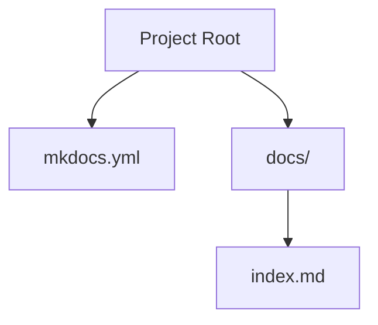
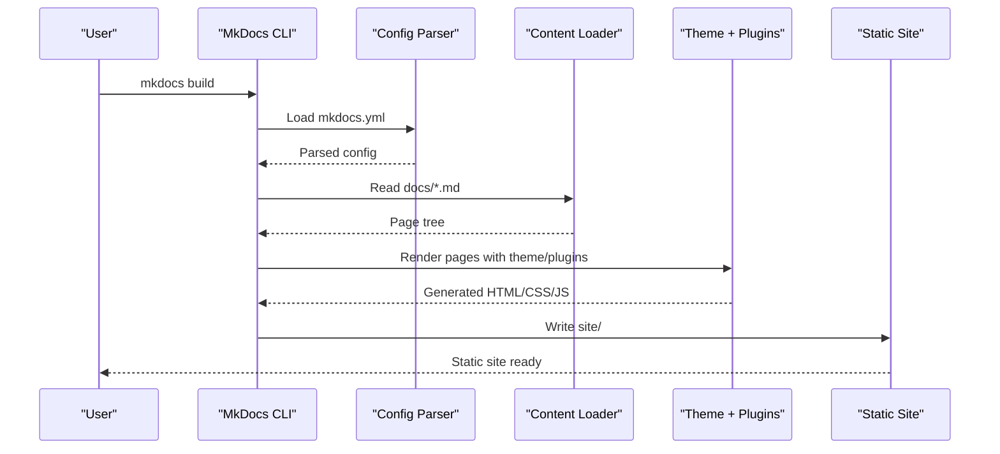
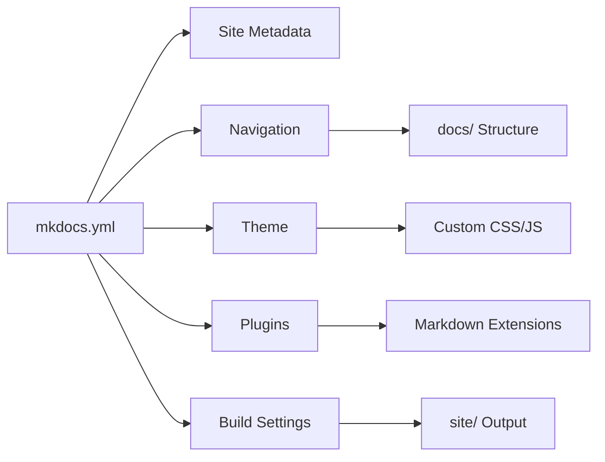

# Configuration Guide

<cite>
**Referenced Files in This Document**
- [mkdocs.yml](file://mkdocs.yml)
- [index.md](file://docs/index.md)
</cite>

## Table of Contents
1. [Introduction](#introduction)
2. [Project Structure](#project-structure)
3. [Core Components](#core-components)
4. [Architecture Overview](#architecture-overview)
5. [Detailed Component Analysis](#detailed-component-analysis)
6. [Dependency Analysis](#dependency-analysis)
7. [Performance Considerations](#performance-considerations)
8. [Troubleshooting Guide](#troubleshooting-guide)
9. [Conclusion](#conclusion)

## Introduction
This guide explains how to configure MkDocs using the mkdocs.yml file. It covers site metadata, navigation, themes, plugins, build settings, YAML syntax requirements, and advanced patterns. The goal is to help beginners set up a working site quickly while giving experienced developers the depth needed for advanced customization.

## Project Structure
A minimal MkDocs project typically includes:
- A root configuration file named mkdocs.yml
- A docs directory containing Markdown files that become pages
- Optional assets (CSS/JS/images) referenced by themes or plugins

**Diagram sources**
- [mkdocs.yml:1-200](file://mkdocs.yml#L1-L200)
- [index.md:1-200](file://docs/index.md#L1-L200)

**Section sources**
- [mkdocs.yml:1-200](file://mkdocs.yml#L1-L200)
- [index.md:1-200](file://docs/index.md#L1-L200)

## Core Components
MkDocs configuration centers around these areas:
- Site metadata: site_name, site_description, site_author, and related fields
- Navigation: defining page order and hierarchy
- Theme: selecting and customizing the look and behavior
- Plugins: extending functionality via third-party or built-in features
- Build settings: controlling output, URLs, and deployment options

These components interact during the build process to generate static HTML from Markdown content.

**Section sources**
- [mkdocs.yml:1-200](file://mkdocs.yml#L1-L200)

## Architecture Overview
The MkDocs build pipeline reads mkdocs.yml, loads Markdown files under docs/, applies theme templates and plugins, and outputs a static site.

**Diagram sources**
- [mkdocs.yml:1-200](file://mkdocs.yml#L1-L200)

## Detailed Component Analysis

### YAML Syntax Requirements
- Use 2-space indentation consistently
- Strings should be quoted when they contain special characters or start with reserved words
- Lists use dash (-) per item; nested lists indent further
- Avoid tabs; use spaces only
- Comments begin with #
- Keep keys lowercase and consistent across sections

Common pitfalls:
- Mixing tabs and spaces
- Missing quotes around values with colons or special characters
- Incorrect list indentation causing parse errors

Validation tips:
- Run mkdocs build early to catch YAML issues
- Use an editor with YAML linting enabled

**Section sources**
- [mkdocs.yml:1-200](file://mkdocs.yml#L1-L200)

### Site Metadata
Key fields:
- site_name: Title of your site
- site_description: Short description used in meta tags
- site_author: Author name for generated pages
- Additional common fields include site_url, repo_url, edit_uri, copyright, and extra_meta

Impact:
- These values appear in HTML <title>, meta descriptions, footers, and repository links
- Proper metadata improves SEO and accessibility

Example scenarios:
- Minimal setup with just site_name
- Full metadata including repository and edit links
- Internationalization-ready setups with site_url variants

**Section sources**
- [mkdocs.yml:1-200](file://mkdocs.yml#L1-L200)

### Navigation Structure
Navigation defines the left sidebar and top-level menu. You can define it in two ways:
- Using the nav key with a hierarchical list of titles and paths
- Using the pages key to automatically infer navigation from file structure

Best practices:
- Keep navigation shallow where possible
- Group related pages under headings
- Use relative paths within docs/
- Maintain consistency between nav and actual file locations

Common issues:
- Broken links due to incorrect paths
- Duplicate entries causing confusion
- Overly deep hierarchies hurting usability

**Section sources**
- [mkdocs.yml:1-200](file://mkdocs.yml#L1-L200)

### Theme Customization
MkDocs supports multiple themes out of the box and allows customization through:
- Selecting a theme (e.g., material, readthedocs)
- Passing theme-specific options via the theme section
- Adding custom CSS/JS via extra_css and extra_javascript
- Overriding templates for advanced changes

Popular themes:
- Material for MkDocs: feature-rich, modern UI
- Read the Docs: clean, documentation-focused
- Bootstrap-based themes for familiar layouts

Customization patterns:
- Override colors and fonts via theme variables
- Add logos and favicons
- Inject analytics or chat widgets via extra scripts

**Section sources**
- [mkdocs.yml:1-200](file://mkdocs.yml#L1-L200)

### Plugin Integration
Plugins extend MkDocs functionality. Common categories:
- Search enhancement
- Code highlighting improvements
- Social media integration
- Content validation and linting
- Deployment helpers

Integration steps:
- Install the plugin package
- Enable it in the plugins section
- Configure plugin-specific options
- Test thoroughly after enabling

Advanced patterns:
- Conditional plugin activation based on environment
- Combining multiple plugins with careful ordering
- Using hooks for custom logic

**Section sources**
- [mkdocs.yml:1-200](file://mkdocs.yml#L1-L200)

### Build Settings
Build-related options control how MkDocs generates your site:
- strict mode for error checking
- dev_server for local development
- remote_branch and other deployment settings
- cache_dir for performance optimization
- markdown_extensions for Markdown processing

Performance considerations:
- Enable caching for faster rebuilds
- Limit unnecessary plugins in production builds
- Optimize images and assets before deployment

**Section sources**
- [mkdocs.yml:1-200](file://mkdocs.yml#L1-L200)

### Advanced Configuration Patterns
- Environment-specific configurations using conditional logic
- Modular configuration splitting with includes
- Dynamic navigation generation via Python scripts
- Multi-language site setup with separate configs

Use cases:
- CI/CD pipelines with different build modes
- Team collaboration with shared base configurations
- Large documentation sites requiring complex navigation

**Section sources**
- [mkdocs.yml:1-200](file://mkdocs.yml#L1-L200)

## Dependency Analysis
Configuration options interact in specific ways:
- Theme selection affects available customization options
- Plugins may require specific themes or versions
- Navigation depends on actual file structure in docs/
- Build settings influence output quality and performance

**Diagram sources**
- [mkdocs.yml:1-200](file://mkdocs.yml#L1-L200)

**Section sources**
- [mkdocs.yml:1-200](file://mkdocs.yml#L1-L200)

## Performance Considerations
- Use incremental builds during development
- Minimize heavy plugins in production
- Optimize images and external resources
- Enable compression and caching where possible
- Monitor build times and identify bottlenecks

## Troubleshooting Guide
Common issues and solutions:
- YAML parsing errors: Validate syntax and indentation
- Missing pages: Check navigation paths match actual files
- Theme not loading: Verify theme installation and configuration
- Plugin conflicts: Disable plugins one by one to identify issues
- Build failures: Run with verbose logging to get detailed error messages

Debugging techniques:
- Use mkdocs build --strict for stricter validation
- Check browser console for client-side errors
- Review MkDocs logs for server-side issues
- Test configurations incrementally

**Section sources**
- [mkdocs.yml:1-200](file://mkdocs.yml#L1-L200)

## Conclusion
MkDocs provides a flexible and powerful configuration system centered around mkdocs.yml. By understanding the core components—metadata, navigation, themes, plugins, and build settings—you can create documentation sites tailored to your needs. Start simple, validate frequently, and gradually add complexity as required. The examples and patterns in this guide should help both beginners and experienced users leverage MkDocs effectively.