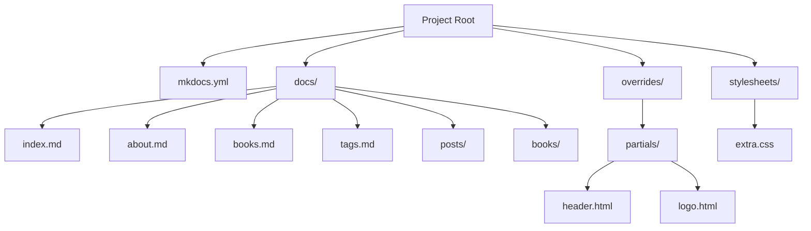
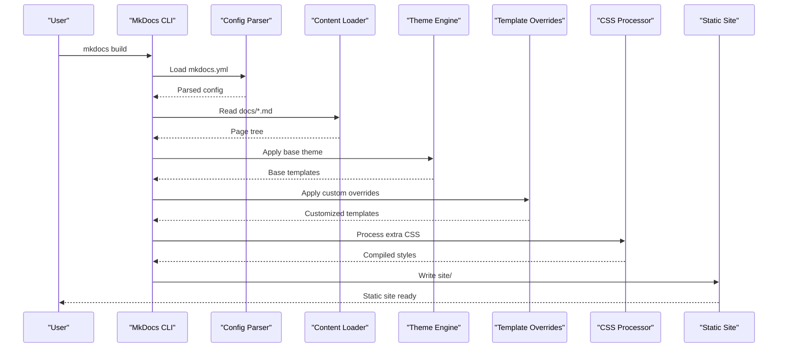
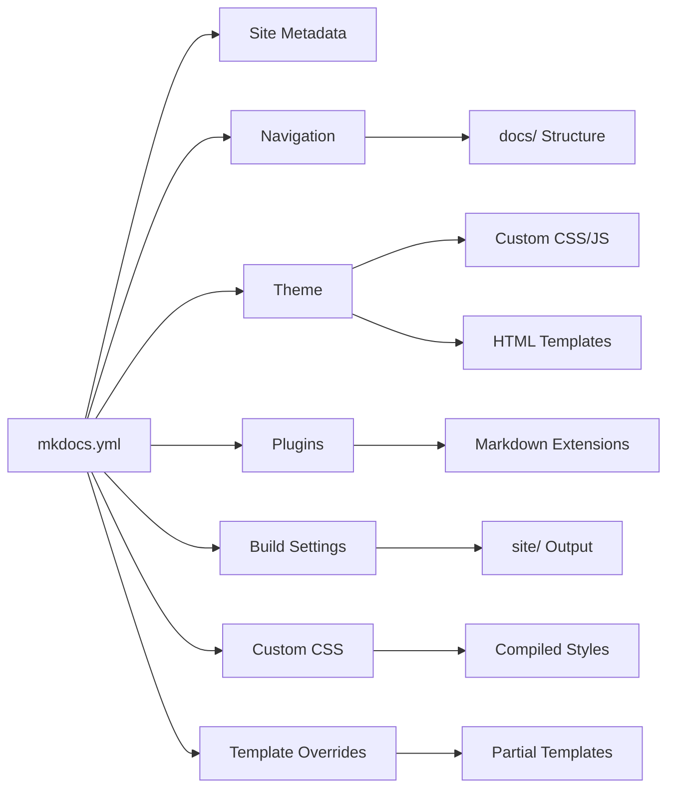

# Configuration Guide

<cite>
**Referenced Files in This Document**
- [mkdocs.yml](file://mkdocs.yml)
- [index.md](file://docs/index.md)
- [about.md](file://docs/about.md)
- [books.md](file://docs/books.md)
- [tags.md](file://docs/tags.md)
- [extra.css](file://docs/stylesheets/extra.css)
- [header.html](file://overrides/partials/header.html)
- [logo.html](file://overrides/partials/logo.html)
</cite>

## Update Summary
**Changes Made**
- Updated all sections to reflect comprehensive MkDocs configuration with navigation structure
- Added detailed coverage of custom theme overrides using HTML templates
- Enhanced CSS styling documentation with extra.css integration
- Expanded project metadata configuration examples
- Added practical examples from actual repository structure
- Updated troubleshooting section with common MkDocs-specific issues

## Table of Contents
1. [Introduction](#introduction)
2. [Project Structure](#project-structure)
3. [Core Components](#core-components)
4. [Architecture Overview](#architecture-overview)
5. [Detailed Component Analysis](#detailed-component-analysis)
6. [Dependency Analysis](#dependency-analysis)
7. [Performance Considerations](#performance-considerations)
8. [Troubleshooting Guide](#troubleshooting-guide)
9. [Conclusion](#conclusion)

## Introduction
This guide explains how to configure MkDocs using the mkdocs.yml file with comprehensive setup including navigation structure, custom theme overrides, CSS styling, and project metadata. It covers site metadata, navigation, themes, plugins, build settings, YAML syntax requirements, and advanced patterns. The goal is to help beginners set up a working site quickly while giving experienced developers the depth needed for advanced customization.

## Project Structure
A comprehensive MkDocs project includes:
- A root configuration file named mkdocs.yml with full site configuration
- A docs directory containing organized Markdown files (index.md, about.md, books.md, tags.md)
- Custom theme overrides in overrides/partials/ directory
- Custom CSS styling in stylesheets/ directory
- Content organization with subdirectories like posts/ and books/

**Diagram sources**
- [mkdocs.yml](file://mkdocs.yml)
- [index.md](file://docs/index.md)
- [extra.css](file://docs/stylesheets/extra.css)
- [header.html](file://overrides/partials/header.html)
- [logo.html](file://overrides/partials/logo.html)

**Section sources**
- [mkdocs.yml](file://mkdocs.yml)
- [index.md](file://docs/index.md)
- [about.md](file://docs/about.md)
- [books.md](file://docs/books.md)
- [tags.md](file://docs/tags.md)

## Core Components
MkDocs configuration centers around these areas:
- Site metadata: site_name, site_description, site_author, and related fields
- Navigation: defining page order and hierarchy with structured menus
- Theme: selecting and customizing the look and behavior with overrides
- Plugins: extending functionality via third-party or built-in features
- Build settings: controlling output, URLs, and deployment options
- Custom styling: CSS customization through extra_css and stylesheets
- Template overrides: HTML template customization for advanced theming

These components interact during the build process to generate static HTML from Markdown content with enhanced customization capabilities.

**Section sources**
- [mkdocs.yml](file://mkdocs.yml)

## Architecture Overview
The MkDocs build pipeline reads mkdocs.yml, loads Markdown files under docs/, applies theme templates and plugins, processes custom CSS, and outputs a static site with full customization support.

**Diagram sources**
- [mkdocs.yml](file://mkdocs.yml)
- [header.html](file://overrides/partials/header.html)
- [logo.html](file://overrides/partials/logo.html)
- [extra.css](file://docs/stylesheets/extra.css)

## Detailed Component Analysis

### YAML Syntax Requirements
- Use 2-space indentation consistently throughout the configuration
- Strings should be quoted when they contain special characters or start with reserved words
- Lists use dash (-) per item; nested lists indent further
- Avoid tabs; use spaces only
- Comments begin with #
- Keep keys lowercase and consistent across sections
- Boolean values should be unquoted true/false
- Numbers don't require quotes unless they're used as strings

Common pitfalls:
- Mixing tabs and spaces causing YAML parse errors
- Missing quotes around values with colons or special characters
- Incorrect list indentation causing navigation structure issues
- Improper boolean formatting leading to unexpected behavior

Validation tips:
- Run mkdocs build early to catch YAML issues
- Use an editor with YAML linting enabled
- Validate navigation structure matches actual file paths

**Section sources**
- [mkdocs.yml](file://mkdocs.yml)

### Site Metadata
Key fields for comprehensive site configuration:
- site_name: Title of your site displayed in browser tabs and headers
- site_description: Short description used in meta tags and SEO
- site_author: Author name for generated pages and copyright
- Additional common fields include site_url, repo_url, edit_uri, copyright, and extra_meta

Impact:
- These values appear in HTML <title>, meta descriptions, footers, and repository links
- Proper metadata improves SEO and accessibility
- Repository links enable direct editing and contribution workflows

Example scenarios:
- Minimal setup with just site_name for quick documentation
- Full metadata including repository and edit links for collaborative projects
- Internationalization-ready setups with site_url variants for multi-language sites

**Section sources**
- [mkdocs.yml](file://mkdocs.yml)

### Navigation Structure
Navigation defines the left sidebar and top-level menu with hierarchical organization:
- Using the nav key with a hierarchical list of titles and paths
- Supporting nested navigation with indented items
- Automatic page generation from file structure
- Custom ordering and grouping of related pages

Best practices:
- Keep navigation shallow where possible for better usability
- Group related pages under logical headings
- Use relative paths within docs/ directory
- Maintain consistency between nav entries and actual file locations
- Include essential pages like index.md, about.md, and contact information

Common issues:
- Broken links due to incorrect paths or missing files
- Duplicate entries causing confusion in the sidebar
- Overly deep hierarchies hurting user experience
- Inconsistent naming between navigation and file names

**Section sources**
- [mkdocs.yml](file://mkdocs.yml)
- [index.md](file://docs/index.md)
- [about.md](file://docs/about.md)
- [books.md](file://docs/books.md)
- [tags.md](file://docs/tags.md)

### Theme Customization
MkDocs supports multiple themes out of the box with extensive customization options:
- Selecting a theme (e.g., material, readthedocs)
- Passing theme-specific options via the theme section
- Adding custom CSS/JS via extra_css and extra_javascript
- Overriding templates for advanced changes using partials

Popular themes:
- Material for MkDocs: feature-rich, modern UI with extensive customization
- Read the Docs: clean, documentation-focused design
- Bootstrap-based themes for familiar layouts

Customization patterns:
- Override colors and fonts via theme variables
- Add logos and favicons through template overrides
- Inject analytics or chat widgets via extra scripts
- Create custom header and logo templates

Advanced override structure:
- Place custom templates in overrides/partials/ directory
- Override specific components like header.html and logo.html
- Maintain original template structure for compatibility
- Use Jinja2 templating language for dynamic content

**Section sources**
- [mkdocs.yml](file://mkdocs.yml)
- [header.html](file://overrides/partials/header.html)
- [logo.html](file://overrides/partials/logo.html)

### CSS Styling Integration
Custom CSS styling enhances the visual appearance of your documentation:
- Using extra_css to load custom stylesheets
- Organizing styles in dedicated stylesheets directory
- Targeting specific elements with CSS selectors
- Responsive design considerations for mobile devices

Implementation approach:
- Create extra.css file in stylesheets directory
- Reference it in mkdocs.yml under extra_css
- Use CSS variables for consistent theming
- Test styles across different screen sizes

Styling best practices:
- Use semantic class names for maintainability
- Implement responsive design principles
- Optimize CSS for performance
- Follow consistent color schemes and typography

**Section sources**
- [mkdocs.yml](file://mkdocs.yml)
- [extra.css](file://docs/stylesheets/extra.css)

### Plugin Integration
Plugins extend MkDocs functionality with additional features:
- Search enhancement for better content discovery
- Code highlighting improvements for programming documentation
- Social media integration for sharing capabilities
- Content validation and linting for quality assurance
- Deployment helpers for automated publishing

Integration steps:
- Install the plugin package via pip
- Enable it in the plugins section of mkdocs.yml
- Configure plugin-specific options
- Test thoroughly after enabling each plugin

Advanced patterns:
- Conditional plugin activation based on environment
- Combining multiple plugins with careful ordering
- Using hooks for custom logic and automation

**Section sources**
- [mkdocs.yml](file://mkdocs.yml)

### Build Settings
Build-related options control how MkDocs generates your site:
- strict mode for error checking and validation
- dev_server for local development with live reloading
- remote_branch and other deployment settings
- cache_dir for performance optimization
- markdown_extensions for Markdown processing enhancements

Performance considerations:
- Enable caching for faster rebuilds during development
- Limit unnecessary plugins in production builds
- Optimize images and assets before deployment
- Configure appropriate compression settings

**Section sources**
- [mkdocs.yml](file://mkdocs.yml)

### Advanced Configuration Patterns
- Environment-specific configurations using conditional logic
- Modular configuration splitting with includes
- Dynamic navigation generation via Python scripts
- Multi-language site setup with separate configs
- Custom template overrides for complete design control
- Integration with CI/CD pipelines for automated deployment

Use cases:
- CI/CD pipelines with different build modes for staging and production
- Team collaboration with shared base configurations
- Large documentation sites requiring complex navigation structures
- Brand-consistent documentation with custom theming

**Section sources**
- [mkdocs.yml](file://mkdocs.yml)

## Dependency Analysis
Configuration options interact in specific ways affecting the overall build process:
- Theme selection affects available customization options and template structure
- Plugins may require specific themes or versions for compatibility
- Navigation depends on actual file structure in docs/ directory
- Build settings influence output quality and performance characteristics
- Custom CSS requires proper loading order and specificity management
- Template overrides must maintain compatibility with base theme structure

**Diagram sources**
- [mkdocs.yml](file://mkdocs.yml)
- [extra.css](file://docs/stylesheets/extra.css)
- [header.html](file://overrides/partials/header.html)
- [logo.html](file://overrides/partials/logo.html)

**Section sources**
- [mkdocs.yml](file://mkdocs.yml)

## Performance Considerations
- Use incremental builds during development for faster iteration
- Minimize heavy plugins in production builds to reduce bundle size
- Optimize images and external resources for faster loading
- Enable compression and caching where possible
- Monitor build times and identify bottlenecks in the pipeline
- Use efficient CSS selectors and minimize stylesheet size
- Implement lazy loading for large assets and images

## Troubleshooting Guide
Common issues and solutions:
- YAML parsing errors: Validate syntax and indentation carefully
- Missing pages: Check navigation paths match actual files in docs/
- Theme not loading: Verify theme installation and configuration
- Plugin conflicts: Disable plugins one by one to identify issues
- Build failures: Run with verbose logging to get detailed error messages
- Custom CSS not applying: Check file paths and CSS specificity
- Template overrides not working: Verify partial file structure and naming

Debugging techniques:
- Use mkdocs build --strict for stricter validation and error reporting
- Check browser console for client-side errors and JavaScript issues
- Review MkDocs logs for server-side issues and warnings
- Test configurations incrementally to isolate problems
- Use browser developer tools to inspect DOM and CSS application
- Validate YAML syntax with online validators before building

**Section sources**
- [mkdocs.yml](file://mkdocs.yml)

## Conclusion
MkDocs provides a flexible and powerful configuration system centered around mkdocs.yml with comprehensive customization capabilities. By understanding the core components—metadata, navigation, themes, plugins, build settings, custom CSS, and template overrides—you can create documentation sites tailored to your specific needs. Start simple with basic configuration, validate frequently during development, and gradually add complexity as required. The examples and patterns covered in this guide should help both beginners and experienced users leverage MkDocs effectively for creating professional documentation sites.