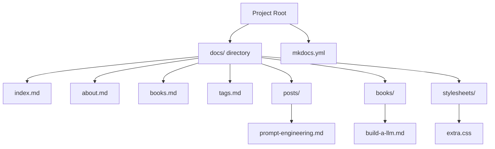

# Content Creation

<cite>
**Referenced Files in This Document**
- [index.md](file://docs/index.md)
- [about.md](file://docs/about.md)
- [books.md](file://docs/books.md)
- [tags.md](file://docs/tags.md)
- [posts/prompt-engineering.md](file://docs/posts/prompt-engineering.md)
- [books/build-a-llm.md](file://docs/books/build-a-llm.md)
- [mkdocs.yml](file://mkdocs.yml)
</cite>

## Update Summary
**Changes Made**
- Updated project structure overview to reflect new content organization with posts directory and books section
- Added documentation for the tags system implementation
- Included about page as part of the documentation structure
- Updated navigation setup to match actual mkdocs.yml configuration
- Enhanced content creation workflow examples with real markdown files from the repository

## Table of Contents
1. [Introduction](#introduction)
2. [Project Structure Overview](#project-structure-overview)
3. [Markdown Syntax Guide](#markdown-syntax-guide)
4. [Documentation Organization](#documentation-organization)
5. [Navigation Setup](#navigation-setup)
6. [Content Best Practices](#content-best-practices)
7. [Advanced Documentation Patterns](#advanced-documentation-patterns)
8. [Media and Assets Management](#media-and-assets-management)
9. [Team Collaboration Guidelines](#team-collaboration-guidelines)
10. [Version Control Integration](#version-control-integration)
11. [Troubleshooting Common Issues](#troubleshooting-common-issues)
12. [Conclusion](#conclusion)

## Introduction

This guide provides comprehensive instructions for creating and maintaining documentation for the Ultra Blogs project using MkDocs. The documentation system is built on Markdown syntax and follows best practices for technical writing, organization, and collaboration. Whether you're contributing your first document or managing a complete documentation set, this guide will help you create clear, well-structured content that serves both new users and experienced developers.

The Ultra Blogs documentation site uses MkDocs, a static site generator optimized for project documentation. It converts Markdown files into a clean, searchable HTML website with automatic navigation generation.

## Project Structure Overview

The Ultra Blogs documentation follows a structured yet flexible organization designed for blog-style content:



**Diagram sources**
- [mkdocs.yml:1-50](file://mkdocs.yml#L1-L50)

The current documentation structure includes:
- `docs/` - Main documentation directory containing all Markdown files
- `docs/index.md` - Entry point and main landing page
- `docs/about.md` - About page providing project information
- `docs/books.md` - Books section index page
- `docs/tags.md` - Tags system index page
- `docs/posts/` - Directory for blog-style posts
- `docs/books/` - Directory for book-length content
- `docs/stylesheets/` - Custom CSS styling
- `mkdocs.yml` - Configuration file for site settings and navigation

**Section sources**
- [index.md:1-20](file://docs/index.md#L1-L20)
- [about.md:1-15](file://docs/about.md#L1-L15)
- [books.md:1-10](file://docs/books.md#L1-L10)
- [tags.md:1-10](file://docs/tags.md#L1-L10)
- [mkdocs.yml:1-30](file://mkdocs.yml#L1-L30)

## Markdown Syntax Guide

### Basic Formatting

#### Headings
Use hierarchical headings to structure your content:

```markdown
# Main Heading (H1)
## Section Heading (H2)
### Subsection Heading (H3)
#### Detailed Section (H4)
```

#### Text Formatting
- **Bold text** for emphasis
- *Italic text* for subtle emphasis
- `Inline code` for technical terms and code references
- ~~Strikethrough~~ for deprecated content

#### Lists
**Unordered lists:**
- First item
- Second item
  - Nested item
  - Another nested item

**Ordered lists:**
1. Step one
2. Step two
3. Step three

#### Links
Internal links within the documentation:
```markdown
[Link text](relative/path/to/page.md)
```

External links:
```markdown
[External resource](https://example.com)
```

### Code Blocks

**Single line code:**
Use backticks for inline code: `console.log('Hello')`

**Multi-line code blocks:**
```python
def hello_world():
    print("Hello, World!")
    return True
```

**Code blocks with syntax highlighting:**
```javascript
const config = {
    title: "Ultra Blogs",
    version: "1.0.0",
    features: ["markdown", "themes", "plugins"]
};
```

**Code blocks with line numbers:**
```python
# Line 1: Import statement
import os
# Line 2: Function definition
def read_file(filename):
    # Line 3: File operations
    with open(filename, 'r') as f:
        return f.read()
```

### Tables

Create structured data presentations:

| Feature | Description | Status | Priority |
|---------|-------------|--------|----------|
| Markdown Support | Full CommonMark compliance | ✅ Active | High |
| Theme System | Customizable appearance | ✅ Active | Medium |
| Plugin API | Extensible functionality | 🔄 In Progress | Low |
| Search | Site-wide search | ✅ Active | High |

### Images and Media

**Basic image insertion:**
```markdown

```

**Image with caption:**
```markdown

*Figure 1: Configuration interface with essential settings highlighted*
```

**Responsive images:**
```markdown


```

### Blockquotes and Notes

**Standard blockquote:**
> This is an important note that readers should pay special attention to when following the tutorial steps.

**Warning and caution boxes:**
⚠️ **Warning:** Always backup your configuration before making changes.

💡 **Tip:** Use environment variables for sensitive configuration values.

📝 **Note:** This feature requires Ultra Blogs version 2.0 or higher.

### Special Elements

#### Definition Lists
**Term**
: Definition of the term with detailed explanation

**Another Term**
: Additional definition providing context

#### Horizontal Rules
---

#### Footnotes
This is a sentence with a footnote reference.[^1]

[^1]: This is the footnote content that appears at the bottom of the page.

## Documentation Organization

### Directory Structure Best Practices

The Ultra Blogs documentation follows a blog-oriented structure that separates different types of content:

```
docs/
├── index.md                    # Main landing page
├── about.md                    # About page with project information
├── books.md                    # Books section index
├── tags.md                     # Tags system index
├── posts/                      # Blog-style posts
│   ├── prompt-engineering.md   # Example post content
│   └── [your-posts].md         # Additional posts
├── books/                      # Book-length content
│   ├── build-a-llm.md          # Example book content
│   └── [your-books].md         # Additional books
└── stylesheets/                # Custom CSS styling
    └── extra.css               # Custom styles
```

### File Naming Conventions

Follow consistent naming patterns for better organization:

- **Use lowercase letters**: `getting-started.md`, not `Getting-Started.md`
- **Separate words with hyphens**: `user-guide.md`, not `userguide.md`
- **Be descriptive but concise**: `installation-guide.md`, not `install.md`
- **Avoid special characters**: Stick to alphanumeric and hyphens only
- **Use plural for collections**: `posts/`, `books/`, `assets/`

### Content Hierarchy Strategy

Structure your content with clear hierarchy levels:

1. **Level 1 (H1)**: Page titles and main sections
2. **Level 2 (H2)**: Major topics and subsections
3. **Level 3 (H3)**: Specific features or steps
4. **Level 4 (H4)**: Detailed explanations or notes

Example structure:
```markdown
# Installation Guide

## Prerequisites
- Node.js 16+
- Git
- Package manager (npm/yarn)

## Installation Steps
### Method 1: Using npm
Step 1: Navigate to your project directory
Step 2: Run the installation command
Step 3: Verify the installation

### Method 2: Using Docker
Prerequisites for Docker method...
```

## Navigation Setup

### MkDocs Configuration

The `mkdocs.yml` file controls site behavior and navigation structure:

```yaml
site_name: Ultra Blogs Documentation
site_description: Comprehensive documentation for Ultra Blogs platform
site_author: Ultra Blogs Team
site_url: https://docs.ultrablogs.com

theme:
  name: material
  palette:
    primary: indigo
    accent: indigo
  font:
    text: Roboto
    code: Roboto Mono

nav:
  - Home: index.md
  - About: about.md
  - Posts:
      - Prompt Engineering: posts/prompt-engineering.md
  - Books:
      - Build an LLM: books/build-a-llm.md
  - Tags: tags.md
```

### Navigation Best Practices

1. **Logical Grouping**: Group related pages under common headings
2. **Consistent Ordering**: Arrange items alphabetically or by importance
3. **Clear Labels**: Use descriptive, action-oriented labels
4. **Limit Depth**: Keep navigation depth to 3-4 levels maximum
5. **Search Optimization**: Include relevant keywords in page titles

### Cross-Linking Between Pages

Create effective internal links:

```markdown
For more information about installation, see the [Installation Guide](user-guide/installation.md).

You can also check out our [API Reference](api-reference/endpoints.md) for detailed endpoint documentation.

See the [Getting Started](getting-started.md) tutorial for a quick overview.
```

## Content Best Practices

### Writing Style Guidelines

#### Clear and Concise Language
- Use active voice: "Configure the settings" instead of "The settings should be configured"
- Avoid jargon unless necessary, and define technical terms
- Write short sentences and paragraphs (3-4 lines maximum)
- Use bullet points for lists of items or steps

#### Consistent Terminology
- Choose one term per concept (e.g., always use "configuration" not "config/settings")
- Define acronyms on first use: "Universal Resource Locator (URL)"
- Maintain consistency across all documentation

#### Audience Awareness
- Consider the skill level of your target audience
- Provide prerequisites and background information
- Include both quick starts and detailed explanations

### Technical Writing Standards

#### Step-by-Step Instructions
1. Number sequential steps clearly
2. Use imperative mood: "Click the button" not "You should click"
3. Include expected outcomes after each step
4. Provide troubleshooting tips for common issues

#### Code Examples
- Include comments explaining complex logic
- Show both input and expected output
- Provide error handling examples
- Use realistic, relatable scenarios

#### Error Handling and Troubleshooting
- Anticipate common mistakes
- Provide clear error messages and solutions
- Include debugging tips and logging information
- Link to relevant support resources

### Content Quality Checklist

Before publishing any documentation:

- [ ] Grammar and spelling checked
- [ ] Screenshots are up-to-date and labeled
- [ ] Code examples are tested and working
- [ ] Links are valid and not broken
- [ ] Information is accurate and current
- [ ] Content follows established style guidelines
- [ ] Navigation links work correctly
- [ ] Mobile responsiveness verified

## Advanced Documentation Patterns

### Blog Post Structure

Create engaging blog-style content with proper formatting:

```markdown
# Prompt Engineering Guide

## Introduction
Brief overview of what prompt engineering is and why it matters...

## Core Concepts
### Understanding Context
Explain how context affects AI responses...

### Crafting Effective Prompts
Provide practical examples and techniques...

## Advanced Techniques
### Chain-of-Thought Prompting
Detailed explanation with examples...

### Few-Shot Learning
How to provide examples in prompts...

## Conclusion
Summary of key takeaways and next steps...
```

### Book Content Organization

Structure longer-form content like books with chapters and sections:

```markdown
# Building Your Own LLM

## Chapter 1: Introduction to Large Language Models
### What are LLMs?
Overview of large language models...

### Why Build Your Own?
Motivation and benefits...

## Chapter 2: Data Preparation
### Collecting Training Data
Methods for gathering quality data...

### Preprocessing Techniques
Cleaning and preparing datasets...

## Chapter 3: Model Architecture
### Transformer Architecture
Deep dive into transformer models...

### Customizing for Your Needs
Adapting architecture for specific use cases...
```

### Tags System Implementation

Organize content with a comprehensive tagging system:

```markdown
# Tags Index

## Technology Tags
- **Python**: Programming language content
- **JavaScript**: Web development content
- **AI/ML**: Artificial intelligence and machine learning
- **DevOps**: Development operations and deployment

## Topic Tags
- **Tutorial**: Step-by-step guides
- **Reference**: API and technical references
- **Guide**: How-to documentation
- **News**: Latest updates and announcements

## Usage Pattern
When creating new content, add relevant tags in the frontmatter:
```yaml
---
title: "My Post Title"
tags: [python, tutorial, ai-ml]
date: 2024-01-01
---
```
```

### Comparison Tables

Use tables to compare options and features:

| Feature | Free Plan | Pro Plan | Enterprise |
|---------|-----------|----------|------------|
| Blog Posts | 5 | Unlimited | Unlimited |
| Custom Domain | ❌ | ✅ | ✅ |
| Analytics | Basic | Advanced | Custom |
| Support | Community | Email | 24/7 Priority |
| Price | $0/month | $9/month | Custom |

### Migration Guides

Provide clear upgrade paths:

```markdown
# Migrating from v1.x to v2.x

## Breaking Changes
- Configuration format has changed
- Deprecated APIs removed
- Database schema updated

## Upgrade Steps
1. Backup your existing installation
2. Update configuration file format
3. Run database migrations
4. Test all functionality
5. Deploy to production

## Rollback Procedure
If issues occur, follow these steps to revert...
```

## Media and Assets Management

### Image Optimization

Best practices for documentation images:

- **Format Selection**: Use PNG for screenshots, JPEG for photos, SVG for diagrams
- **File Size**: Optimize images to reduce load times (under 100KB when possible)
- **Dimensions**: Match display dimensions to avoid browser scaling
- **Alt Text**: Always include descriptive alt text for accessibility
- **Naming**: Use descriptive, lowercase filenames with hyphens

### Asset Organization

```
docs/assets/
├── images/
│   ├── screenshots/
│   ├── diagrams/
│   └── logos/
├── videos/
├── downloads/
└── fonts/
```

### Embedding External Resources

**YouTube Videos:**
```markdown
<iframe width="560" height="314" 
        src="https://www.youtube.com/embed/video-id" 
        frameborder="0" 
        allowfullscreen>
</iframe>
```

**Interactive Demos:**
```markdown
[Live Demo](https://demo.example.com)
```

**Code Sandboxes:**
```markdown
[Open in CodeSandbox](https://codesandbox.io/s/example)
```

## Team Collaboration Guidelines

### Documentation Workflow

Establish a clear workflow for team contributions:

1. **Planning**: Discuss new documentation needs in team meetings
2. **Assignment**: Assign ownership for major documentation sections
3. **Drafting**: Create initial content following style guidelines
4. **Review**: Peer review for accuracy and clarity
5. **Testing**: Verify links, images, and cross-references
6. **Publishing**: Deploy to staging for final review
7. **Maintenance**: Regular updates and maintenance schedule

### Version Control Best Practices

#### Git Workflow for Documentation
```bash
# Create feature branch for documentation updates
git checkout -b docs/update-api-reference

# Make changes and commit with descriptive messages
git add docs/api-reference/endpoints.md
git commit -m "Update API reference with new authentication endpoints"

# Push and create pull request
git push origin docs/update-api-reference
```

#### Commit Message Standards
- **Feature**: "Add user authentication documentation"
- **Fix**: "Fix broken links in getting started guide"
- **Update**: "Update installation instructions for new requirements"
- **Remove**: "Deprecate outdated plugin documentation"

### Review Process

Implement a structured review process:

1. **Automated Checks**: Spell checking, link validation, image optimization
2. **Peer Review**: At least one other team member reviews content
3. **Technical Accuracy**: Subject matter expert verifies technical details
4. **Style Compliance**: Editor checks against style guidelines
5. **Final Approval**: Lead reviewer approves for publication

### Conflict Resolution

Handle documentation conflicts effectively:

- **Merge Conflicts**: Resolve through discussion and consensus
- **Content Disputes**: Base decisions on user needs and project goals
- **Style Differences**: Follow established style guide consistently
- **Outdated Content**: Prioritize accuracy over completeness

## Version Control Integration

### Branching Strategy

```
main
├── develop
├── feature/add-search-functionality
├── hotfix/fix-broken-links
└── release/v2.1.0
```

### Automated Deployment

Set up continuous integration for documentation:

```yaml
# .github/workflows/docs-deploy.yml
name: Deploy Documentation
on:
  push:
    branches: [main]
  pull_request:
    branches: [main]

jobs:
  deploy:
    runs-on: ubuntu-latest
    steps:
      - uses: actions/checkout@v2
      - name: Set up Python
        uses: actions/setup-python@v2
        with:
          python-version: '3.9'
      - name: Install dependencies
        run: pip install mkdocs mkdocs-material
      - name: Build documentation
        run: mkdocs build
      - name: Deploy to GitHub Pages
        if: github.ref == 'refs/heads/main'
        uses: peaceiris/actions-gh-pages@v3
        with:
          github_token: ${{ secrets.GITHUB_TOKEN }}
          publish_dir: ./site
```

### Quality Gates

Implement automated quality checks:

- **Spell Checking**: Check for spelling errors and typos
- **Link Validation**: Verify all internal and external links
- **Image Optimization**: Ensure images meet size requirements
- **Build Validation**: Confirm documentation builds without errors
- **Accessibility Audit**: Check for accessibility compliance

## Troubleshooting Common Issues

### Build Errors

**Common MkDocs Errors:**
- **Missing Dependencies**: Install required packages with `pip install mkdocs mkdocs-material`
- **Broken Links**: Use link checker tools to identify and fix broken references
- **Image Path Issues**: Verify relative paths and file existence
- **Theme Problems**: Ensure theme compatibility and proper configuration

### Content Issues

**Formatting Problems:**
- **Markdown Syntax**: Validate Markdown syntax with online validators
- **Table Alignment**: Ensure proper column alignment in tables
- **Code Block Formatting**: Verify syntax highlighting and indentation
- **Link Formatting**: Check URL encoding and path correctness

**Navigation Issues:**
- **Missing Pages**: Verify all referenced pages exist
- **Incorrect Paths**: Double-check relative and absolute paths
- **Circular References**: Avoid circular dependencies between pages

### Performance Optimization

**Site Loading Speed:**
- **Image Optimization**: Compress images and use appropriate formats
- **Asset Minification**: Enable CSS and JavaScript minification
- **Caching Strategy**: Implement proper caching headers
- **CDN Usage**: Consider using CDN for static assets

## Conclusion

Creating effective documentation for Ultra Blogs requires a systematic approach to content creation, organization, and maintenance. By following the guidelines outlined in this document, teams can produce high-quality, maintainable documentation that serves both new users and experienced developers.

Key takeaways:
- **Start Simple**: Begin with essential documentation and expand gradually
- **Stay Consistent**: Follow established patterns and style guidelines
- **Test Thoroughly**: Validate all links, images, and code examples
- **Collaborate Effectively**: Establish clear workflows and review processes
- **Maintain Regularly**: Keep documentation current with code changes

Remember that good documentation is an ongoing process that evolves with your project. Regular updates, user feedback, and continuous improvement will ensure your documentation remains valuable and effective.

The investment in quality documentation pays dividends in reduced support costs, faster onboarding, and improved user satisfaction. Start implementing these practices today to create documentation that truly serves your users and contributes to the success of the Ultra Blogs project.