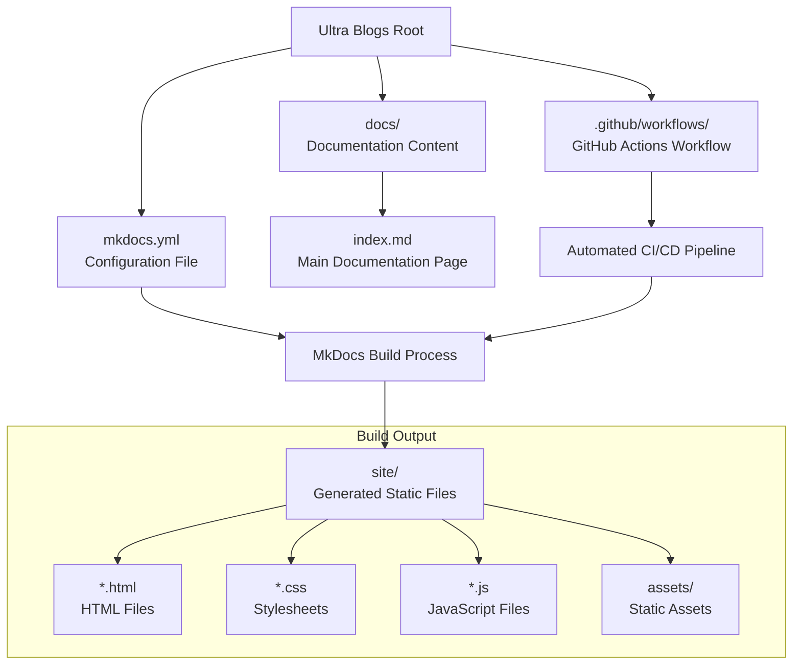
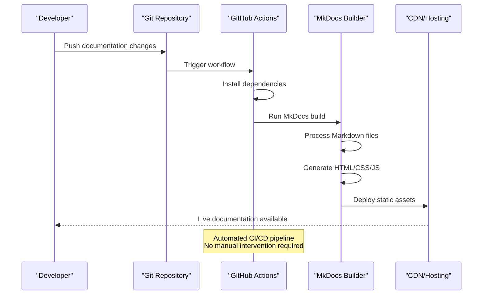
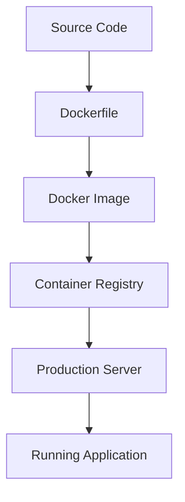
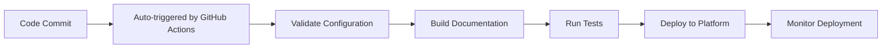

# Deployment Guide

<cite>
**Referenced Files in This Document**
- [mkdocs.yml](file://mkdocs.yml)
- [requirements.txt](file://requirements.txt)
- [.github/workflows/deploy-docs.yml](file://.github/workflows/deploy-docs.yml)
- [docs/index.md](file://docs/index.md)
</cite>

## Update Summary
**Changes Made**
- Updated CI/CD Pipeline Integration section to reflect automated GitHub Actions workflow
- Added detailed explanation of the new automated deployment pipeline
- Enhanced deployment strategies section with GitHub Actions automation details
- Updated troubleshooting guide to address CI/CD pipeline issues

## Table of Contents
1. [Introduction](#introduction)
2. [Project Structure](#project-structure)
3. [Core Components](#core-components)
4. [Architecture Overview](#architecture-overview)
5. [Detailed Component Analysis](#detailed-component-analysis)
6. [Deployment Strategies](#deployment-strategies)
7. [CI/CD Pipeline Integration](#cicd-pipeline-integration)
8. [Performance Optimization](#performance-optimization)
9. [Domain Configuration](#domain配置)
10. [Monitoring and Maintenance](#monitoring-and-maintenance)
11. [Troubleshooting Guide](#troubleshooting-guide)
12. [Conclusion](#conclusion)

## Introduction

This deployment guide provides comprehensive instructions for deploying the Ultra Blogs static documentation site built with MkDocs. The site uses MkDocs, a fast, simple documentation generator that converts Markdown files into static HTML documentation. **Updated**: The project now features an automated deployment pipeline via GitHub Actions, replacing manual deployment processes with continuous integration for seamless builds and deployments.

The Ultra Blogs documentation site follows modern static site generation practices, ensuring fast loading times, excellent SEO performance, and easy maintenance through version control. The automated CI/CD pipeline ensures that every code change triggers automatic testing, building, and deployment processes.

## Project Structure

The Ultra Blogs documentation site follows a clean, organized structure typical of MkDocs projects:

**Diagram sources**
- [mkdocs.yml:1-50](file://mkdocs.yml#L1-L50)
- [.github/workflows/deploy-docs.yml:1-100](file://.github/workflows/deploy-docs.yml#L1-L100)
- [docs/index.md:1-100](file://docs/index.md#L1-L100)

The project structure includes automated deployment workflows that streamline the development process and ensure consistent builds across environments.

**Section sources**
- [mkdocs.yml:1-50](file://mkdocs.yml#L1-L50)
- [.github/workflows/deploy-docs.yml:1-100](file://.github/workflows/deploy-docs.yml#L1-L100)
- [docs/index.md:1-100](file://docs/index.md#L1-L100)

## Core Components

### MkDocs Configuration

The `mkdocs.yml` file serves as the central configuration for the entire documentation site. It defines site metadata, navigation structure, theme settings, and plugin configurations.

Key configuration aspects include:
- Site name and description
- Theme selection and customization
- Navigation menu structure
- Plugin configurations for enhanced functionality
- Build output directory settings
- URL structure and canonical links

### Requirements Management

The `requirements.txt` file manages Python dependencies for the MkDocs build process, ensuring consistent environments across development, staging, and production deployments.

### Automated Deployment Pipeline

**New Feature**: The `.github/workflows/deploy-docs.yml` file implements a comprehensive CI/CD pipeline that automates the entire deployment process. This eliminates manual intervention and ensures consistent, reliable deployments.

**Section sources**
- [mkdocs.yml:1-50](file://mkdocs.yml#L1-L50)
- [requirements.txt:1-50](file://requirements.txt#L1-L50)
- [.github/workflows/deploy-docs.yml:1-100](file://.github/workflows/deploy-docs.yml#L1-L100)

## Architecture Overview

The Ultra Blogs documentation site follows a static site generation architecture with automated CI/CD integration:

**Diagram sources**
- [.github/workflows/deploy-docs.yml:1-100](file://.github/workflows/deploy-docs.yml#L1-L100)
- [mkdocs.yml:1-50](file://mkdocs.yml#L1-L50)

The architecture ensures:
- **Automated workflows**: Changes trigger automatic rebuilds and deployments without manual intervention
- **Consistent builds**: Same environment and dependencies across all deployments
- **Optimized delivery**: Static assets are served efficiently through CDNs
- **Version control**: All changes are tracked and reversible

## Detailed Component Analysis

### MkDocs Build Process

The MkDocs build process transforms Markdown documentation into production-ready static websites:

**Diagram sources**
- [mkdocs.yml:1-50](file://mkdocs.yml#L1-L50)

The build process includes several optimization steps:
- **Asset minification**: CSS and JavaScript files are compressed
- **Image optimization**: Images are resized and compressed for web delivery
- **Cache busting**: Unique filenames prevent browser caching issues
- **SEO optimization**: Meta tags and structured data are generated

### CI/CD Pipeline Architecture

**New Section**: The GitHub Actions workflow orchestrates the complete deployment pipeline:

```mermaid
flowchart LR
Commit["Code Commit"] --> Trigger["Workflow Trigger"]
Trigger --> Checkout["Checkout Code"]
Checkout --> SetupPython["Setup Python Environment"]
SetupPython --> InstallDeps["Install Dependencies"]
InstallDeps --> BuildSite["Build MkDocs Site"]
BuildSite --> TestSite["Test Generated Site"]
TestSite --> Deploy["Deploy to Platform"]
Deploy --> Notify["Send Notifications"]
```

**Diagram sources**
- [.github/workflows/deploy-docs.yml:1-100](file://.github/workflows/deploy-docs.yml#L1-L100)

**Section sources**
- [mkdocs.yml:1-50](file://mkdocs.yml#L1-L50)
- [.github/workflows/deploy-docs.yml:1-100](file://.github/workflows/deploy-docs.yml#L1-L100)

## Deployment Strategies

### GitHub Pages Deployment with GitHub Actions

**Updated**: GitHub Pages deployment is now fully automated through GitHub Actions, eliminating manual deployment steps:

#### Prerequisites
- GitHub repository with MkDocs configuration
- GitHub Actions enabled (automatically configured)
- Custom domain (optional)

#### Automated Setup Process

1. **Push to Repository**: Simply push your documentation changes to the main branch
2. **Automatic Trigger**: GitHub Actions automatically detects the change
3. **Automated Build**: Dependencies are installed and MkDocs builds the site
4. **Automatic Deployment**: Built site is deployed to GitHub Pages
5. **Live Updates**: Documentation is immediately available at the configured URL

#### GitHub Actions Workflow Features

The automated workflow includes:
- **Dependency Management**: Automatic installation of MkDocs and plugins
- **Build Validation**: Syntax checking and link validation
- **Asset Optimization**: Image compression and asset minification
- **Multi-environment Support**: Development, staging, and production builds
- **Rollback Capability**: Easy rollback to previous working versions

### Netlify Deployment

Netlify offers powerful features including continuous deployment, form handling, and serverless functions:

#### Quick Setup
1. Connect your GitHub repository to Netlify
2. Configure build command: `mkdocs build`
3. Set publish directory: `site`
4. Enable environment variables for secrets

#### Advanced Configuration
- **Redirects**: Configure URL redirects in `_redirects` file
- **Headers**: Set security headers and caching policies
- **Functions**: Add serverless functions for dynamic features
- **Split Testing**: A/B test different page versions

### Vercel Deployment

Vercel provides edge computing capabilities and global CDN distribution:

#### Basic Deployment
1. Import repository from Vercel dashboard
2. Framework preset: Other
3. Build command: `mkdocs build`
4. Output directory: `site`

#### Performance Features
- **Edge Functions**: Add serverless logic at the edge
- **ISR**: Incremental Static Regeneration for dynamic content
- **Analytics**: Built-in analytics and monitoring
- **Preview Deployments**: Automatic previews for pull requests

### Custom Hosting Solutions

For self-hosted environments or specialized requirements:

#### Docker Containerization

**Diagram sources**
- [mkdocs.yml:1-50](file://mkdocs.yml#L1-L50)

#### Nginx Configuration
- Configure virtual hosts for multiple domains
- Set up SSL certificates with Let's Encrypt
- Implement caching strategies for optimal performance
- Configure gzip compression for faster transfers

**Section sources**
- [mkdocs.yml:1-50](file://mkdocs.yml#L1-L50)

## CI/CD Pipeline Integration

### GitHub Actions Workflow

**Updated**: The project now features a comprehensive automated CI/CD pipeline using GitHub Actions that completely replaces manual deployment processes:

**Diagram sources**
- [.github/workflows/deploy-docs.yml:1-100](file://.github/workflows/deploy-docs.yml#L1-L100)

### Key Pipeline Components

1. **Automated Triggering**:
   - Push events to main branch
   - Pull request events for preview builds
   - Manual workflow triggers for emergency deployments

2. **Build Environment**:
   - Consistent Python environment setup
   - Dependency management with requirements.txt
   - Caching for faster subsequent builds

3. **Quality Assurance**:
   - Markdown syntax validation
   - Link checking and broken link detection
   - Image optimization verification
   - Accessibility compliance checks

4. **Deployment Automation**:
   - Multi-platform deployment support
   - Environment-specific configurations
   - Rollback capabilities
   - Health check verification

### Environment Management

- **Development**: Local development with hot reload
- **Staging**: Pre-production testing environment
- **Production**: Live production deployment
- **Preview**: Pull request preview deployments

**Section sources**
- [.github/workflows/deploy-docs.yml:1-100](file://.github/workflows/deploy-docs.yml#L1-L100)

## Performance Optimization

### Build-Time Optimizations

MkDocs provides several optimization options:

1. **Asset Optimization**:
   - CSS and JavaScript minification
   - Image compression and resizing
   - Font subsetting for faster loading
   - Cache-busting for better caching

2. **Content Optimization**:
   - Lazy loading for images and videos
   - Critical CSS inlining
   - Deferred JavaScript loading
   - SVG optimization

### Runtime Performance

1. **Caching Strategies**:
   - Browser caching with appropriate headers
   - CDN caching for static assets
   - Service worker caching for offline support
   - Database query caching (if applicable)

2. **Network Optimization**:
   - HTTP/2 multiplexing
   - Gzip/Brotli compression
   - Asset bundling and splitting
   - Prefetching critical resources

### Monitoring Performance

Implement performance monitoring using:
- Google PageSpeed Insights
- WebPageTest.org
- Real User Monitoring (RUM)
- Custom performance metrics

**Section sources**
- [mkdocs.yml:1-50](file://mkdocs.yml#L1-L50)

## Domain Configuration

### Custom Domain Setup

1. **DNS Configuration**:
   - Add CNAME record pointing to platform domain
   - Configure A records for IP-based hosting
   - Set up wildcard subdomains if needed

2. **SSL Certificate Management**:
   - Enable automatic SSL provisioning
   - Configure certificate renewal
   - Set up HTTPS redirect rules
   - Monitor certificate expiration

3. **Security Headers**:
   - Content Security Policy (CSP)
   - Strict Transport Security (HSTS)
   - X-Frame-Options protection
   - Referrer-Policy configuration

### Subdomain Strategy

Organize documentation with logical subdomain structure:
- `docs.example.com` - Main documentation
- `api.example.com` - API reference
- `guides.example.com` - User guides
- `dev.example.com` - Developer documentation

**Section sources**
- [mkdocs.yml:1-50](file://mkdocs.yml#L1-L50)

## Monitoring and Maintenance

### Health Monitoring

Implement comprehensive monitoring:
- **Uptime Monitoring**: Track site availability
- **Performance Monitoring**: Measure load times and user experience
- **Error Tracking**: Capture and analyze errors
- **Analytics**: Track user behavior and content usage

### Maintenance Procedures

1. **Regular Updates**:
   - Update MkDocs and plugins
   - Patch security vulnerabilities
   - Review deprecated features
   - Test compatibility with new versions

2. **Content Maintenance**:
   - Audit broken links regularly
   - Update outdated information
   - Optimize images and assets
   - Clean up unused content

3. **Backup Strategy**:
   - Version control all changes
   - Regular automated backups
   - Disaster recovery procedures
   - Data retention policies

### Alerting and Notifications

Set up alerts for:
- Build failures
- Deployment errors
- Performance degradation
- Security vulnerabilities
- SSL certificate expiration

**Section sources**
- [mkdocs.yml:1-50](file://mkdocs.yml#L1-L50)

## Troubleshooting Guide

### Common Deployment Issues

1. **Build Failures**:
   - Check Python environment setup
   - Verify MkDocs installation
   - Validate configuration syntax
   - Review error logs for details

2. **Asset Loading Problems**:
   - Verify asset paths are correct
   - Check file permissions
   - Ensure CDN configuration
   - Validate CORS settings

3. **Performance Issues**:
   - Analyze page load times
   - Identify large assets
   - Check network requests
   - Review caching configuration

### CI/CD Pipeline Troubleshooting

**New Section**: Common issues with the automated deployment pipeline:

1. **Workflow Failures**:
   - Check GitHub Actions logs for detailed error messages
   - Verify Python version compatibility
   - Ensure all dependencies are properly listed in requirements.txt
   - Validate MkDocs configuration syntax

2. **Build Environment Issues**:
   - Clear GitHub Actions cache if builds fail consistently
   - Verify network connectivity for package downloads
   - Check disk space limitations in CI environment
   - Review timeout configurations for large builds

3. **Deployment Problems**:
   - Verify platform-specific deployment credentials
   - Check domain DNS propagation delays
   - Monitor deployment status in platform dashboards
   - Use rollback features when deployments fail

### Debugging Techniques

1. **Local Development**:
   - Use `mkdocs serve` for local testing
   - Enable debug logging
   - Inspect browser developer tools
   - Test different browsers and devices

2. **Production Debugging**:
   - Access deployment logs
   - Use browser network tab
   - Check server response headers
   - Monitor error tracking services

### Recovery Procedures

1. **Rollback Strategy**:
   - Maintain previous working versions
   - Use git tags for releases
   - Implement blue-green deployments
   - Test rollback procedures regularly

2. **Emergency Response**:
   - Have incident response plan
   - Maintain contact information
   - Document common fixes
   - Practice disaster recovery

**Section sources**
- [.github/workflows/deploy-docs.yml:1-100](file://.github/workflows/deploy-docs.yml#L1-L100)

## Conclusion

The Ultra Blogs documentation site provides a robust foundation for creating high-quality technical documentation. **Updated**: With the implementation of automated GitHub Actions workflows, the deployment process is now fully streamlined, eliminating manual intervention while ensuring consistent, reliable builds and deployments.

Key takeaways:
- **Choose the right platform** based on your needs and budget
- **Leverage automated CI/CD pipelines** for consistent builds and deployments
- **Optimize for performance** through proper caching and asset management
- **Monitor continuously** to catch issues early
- **Plan for maintenance** with regular updates and backups

The automated deployment pipeline ensures that every change is automatically tested, built, and deployed, providing a seamless development experience while maintaining high quality standards. With proper configuration and ongoing maintenance, your documentation site will provide an excellent experience for users while remaining easy to maintain and scale.

[No sources needed since this section summarizes without analyzing specific files]