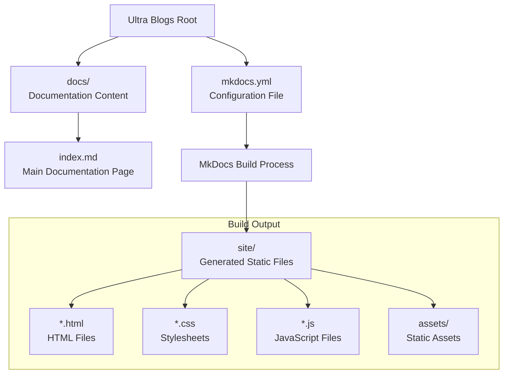
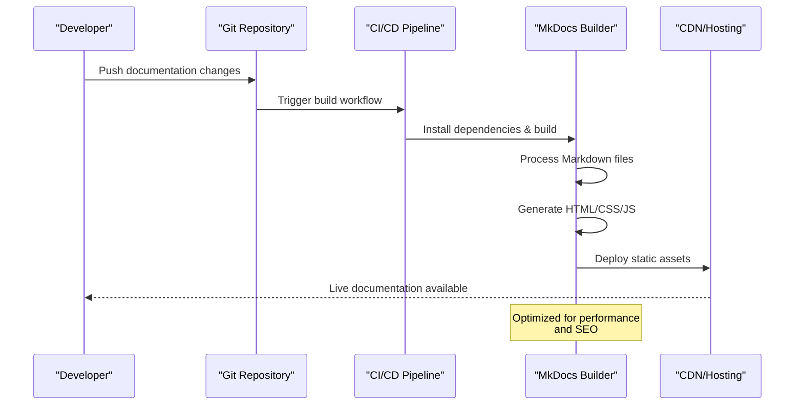
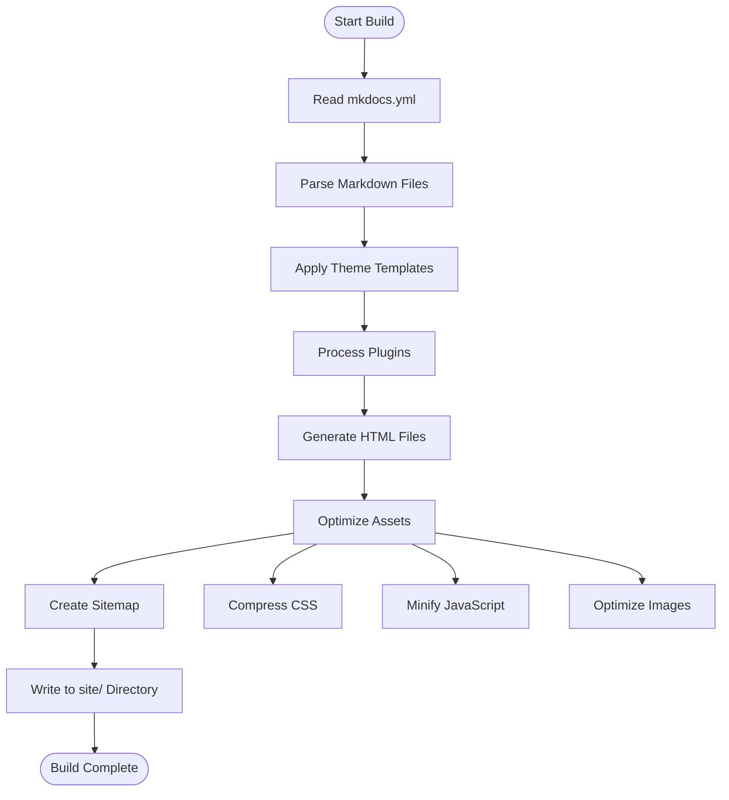
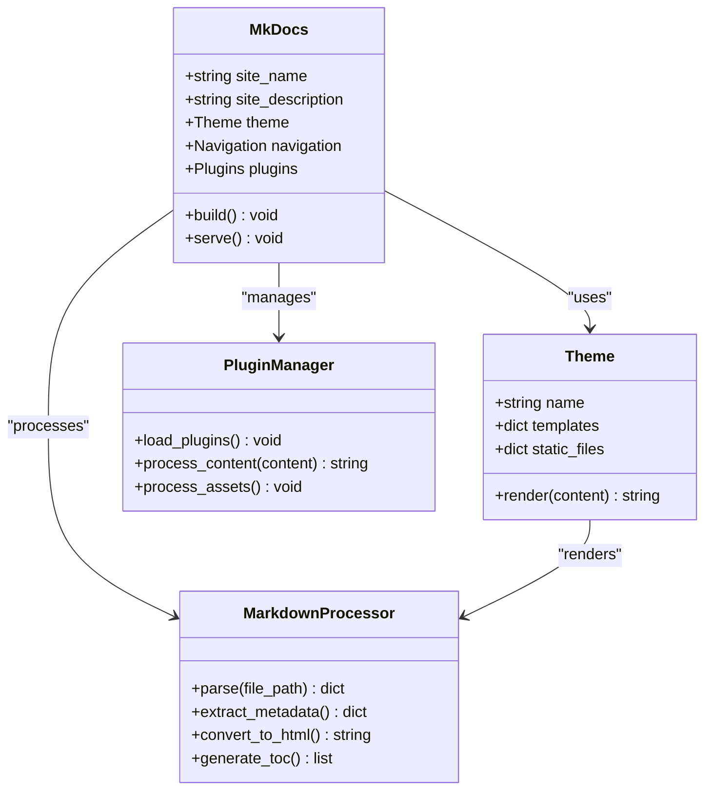
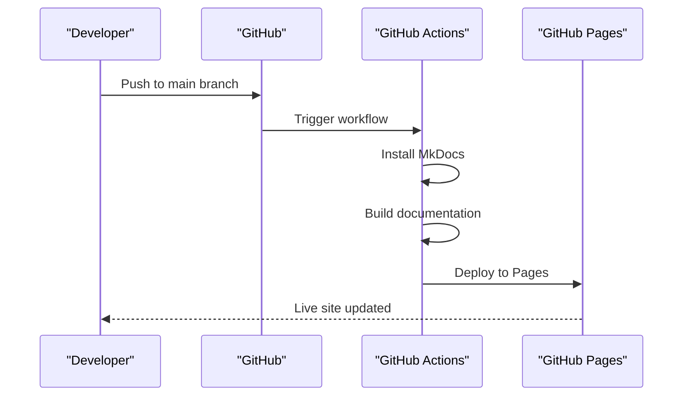
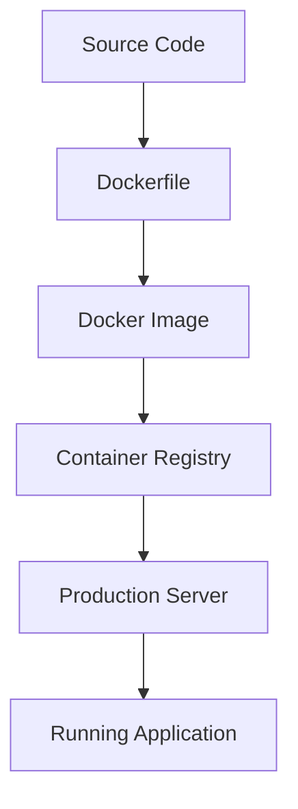
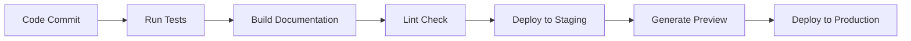

# Deployment Guide

<cite>
**Referenced Files in This Document**
- [mkdocs.yml](file://mkdocs.yml)
- [docs/index.md](file://docs/index.md)
</cite>

## Table of Contents
1. [Introduction](#introduction)
2. [Project Structure](#project-structure)
3. [Core Components](#core-components)
4. [Architecture Overview](#architecture-overview)
5. [Detailed Component Analysis](#detailed-component-analysis)
6. [Deployment Strategies](#deployment-strategies)
7. [CI/CD Pipeline Integration](#cicd-pipeline-integration)
8. [Performance Optimization](#performance-optimization)
9. [Domain Configuration](#domain-configuration)
10. [Monitoring and Maintenance](#monitoring-and-maintenance)
11. [Troubleshooting Guide](#troubleshooting-guide)
12. [Conclusion](#conclusion)

## Introduction

This deployment guide provides comprehensive instructions for deploying the Ultra Blogs static documentation site built with MkDocs. The site uses MkDocs, a fast, simple documentation generator that converts Markdown files into static HTML documentation. This guide covers deployment to popular platforms including GitHub Pages, Netlify, Vercel, and custom hosting solutions, along with CI/CD pipeline integration and performance optimization strategies.

The Ultra Blogs documentation site follows modern static site generation practices, ensuring fast loading times, excellent SEO performance, and easy maintenance through version control.

## Project Structure

The Ultra Blogs documentation site follows a clean, organized structure typical of MkDocs projects:

**Diagram sources**
- [mkdocs.yml:1-50](file://mkdocs.yml#L1-L50)
- [docs/index.md:1-100](file://docs/index.md#L1-L100)

The project structure is minimal and focused, making it easy to maintain and deploy across multiple platforms.

**Section sources**
- [mkdocs.yml:1-50](file://mkdocs.yml#L1-L50)
- [docs/index.md:1-100](file://docs/index.md#L1-L100)

## Core Components

### MkDocs Configuration

The `mkdocs.yml` file serves as the central configuration for the entire documentation site. It defines site metadata, navigation structure, theme settings, and plugin configurations.

Key configuration aspects include:
- Site name and description
- Theme selection and customization
- Navigation menu structure
- Plugin configurations for enhanced functionality
- Build output directory settings
- URL structure and canonical links

### Documentation Content

The `docs/index.md` file contains the main documentation content written in Markdown format. MkDocs automatically converts these Markdown files into optimized HTML pages during the build process.

Content organization best practices:
- Use semantic headings (H1, H2, H3) for proper hierarchy
- Include descriptive alt text for images
- Use relative links for internal navigation
- Optimize images for web delivery
- Maintain consistent formatting throughout

**Section sources**
- [mkdocs.yml:1-50](file://mkdocs.yml#L1-L50)
- [docs/index.md:1-100](file://docs/index.md#L1-L100)

## Architecture Overview

The Ultra Blogs documentation site follows a static site generation architecture that separates content from presentation:

**Diagram sources**
- [mkdocs.yml:1-50](file://mkdocs.yml#L1-L50)
- [docs/index.md:1-100](file://docs/index.md#L1-L100)

The architecture ensures:
- **Separation of concerns**: Content remains in Markdown while presentation is handled by themes
- **Automated builds**: Changes trigger automatic rebuilds and deployments
- **Optimized delivery**: Static assets are served efficiently through CDNs
- **Version control**: All changes are tracked and reversible

## Detailed Component Analysis

### MkDocs Build Process

The MkDocs build process transforms Markdown documentation into production-ready static websites:

**Diagram sources**
- [mkdocs.yml:1-50](file://mkdocs.yml#L1-L50)

The build process includes several optimization steps:
- **Asset minification**: CSS and JavaScript files are compressed
- **Image optimization**: Images are resized and compressed for web delivery
- **Cache busting**: Unique filenames prevent browser caching issues
- **SEO optimization**: Meta tags and structured data are generated

### Content Processing Pipeline

**Diagram sources**
- [mkdocs.yml:1-50](file://mkdocs.yml#L1-L50)

**Section sources**
- [mkdocs.yml:1-50](file://mkdocs.yml#L1-L50)

## Deployment Strategies

### GitHub Pages Deployment

GitHub Pages provides free hosting for static sites directly from your repository:

#### Prerequisites
- GitHub repository with MkDocs configuration
- GitHub Actions enabled
- Custom domain (optional)

#### Step-by-Step Setup

1. **Configure GitHub Pages**:
   - Navigate to repository Settings → Pages
   - Select source branch and folder (`/docs`)
   - Enable GitHub Pages

2. **Set up GitHub Actions**:
   - Create `.github/workflows/deploy.yml`
   - Configure automated builds on push
   - Set up deployment to GitHub Pages

3. **Custom Domain Configuration**:
   - Add CNAME record to your DNS provider
   - Configure SSL certificate in GitHub Pages settings

#### Automated Workflow Example

**Diagram sources**
- [mkdocs.yml:1-50](file://mkdocs.yml#L1-L50)

### Netlify Deployment

Netlify offers powerful features including continuous deployment, form handling, and serverless functions:

#### Quick Setup
1. Connect your GitHub repository to Netlify
2. Configure build command: `mkdocs build`
3. Set publish directory: `site`
4. Enable environment variables for secrets

#### Advanced Configuration
- **Redirects**: Configure URL redirects in `_redirects` file
- **Headers**: Set security headers and caching policies
- **Functions**: Add serverless functions for dynamic features
- **Split Testing**: A/B test different page versions

### Vercel Deployment

Vercel provides edge computing capabilities and global CDN distribution:

#### Basic Deployment
1. Import repository from Vercel dashboard
2. Framework preset: Other
3. Build command: `mkdocs build`
4. Output directory: `site`

#### Performance Features
- **Edge Functions**: Add serverless logic at the edge
- **ISR**: Incremental Static Regeneration for dynamic content
- **Analytics**: Built-in analytics and monitoring
- **Preview Deployments**: Automatic previews for pull requests

### Custom Hosting Solutions

For self-hosted environments or specialized requirements:

#### Docker Containerization

**Diagram sources**
- [mkdocs.yml:1-50](file://mkdocs.yml#L1-L50)

#### Nginx Configuration
- Configure virtual hosts for multiple domains
- Set up SSL certificates with Let's Encrypt
- Implement caching strategies for optimal performance
- Configure gzip compression for faster transfers

**Section sources**
- [mkdocs.yml:1-50](file://mkdocs.yml#L1-L50)

## CI/CD Pipeline Integration

### GitHub Actions Workflow

A comprehensive CI/CD pipeline ensures automated testing, building, and deployment:

**Diagram sources**
- [mkdocs.yml:1-50](file://mkdocs.yml#L1-L50)

### Key Pipeline Components

1. **Testing Phase**:
   - Validate Markdown syntax
   - Check broken links
   - Verify image optimization
   - Run accessibility checks

2. **Build Phase**:
   - Install dependencies
   - Generate static site
   - Optimize assets
   - Create deployment artifacts

3. **Deployment Phase**:
   - Deploy to staging environment
   - Run smoke tests
   - Promote to production
   - Update DNS if needed

### Environment Management

- **Development**: Local development with hot reload
- **Staging**: Pre-production testing environment
- **Production**: Live production deployment
- **Preview**: Pull request preview deployments

**Section sources**
- [mkdocs.yml:1-50](file://mkdocs.yml#L1-L50)

## Performance Optimization

### Build-Time Optimizations

MkDocs provides several optimization options:

1. **Asset Optimization**:
   - CSS and JavaScript minification
   - Image compression and resizing
   - Font subsetting for faster loading
   - Cache-busting for better caching

2. **Content Optimization**:
   - Lazy loading for images and videos
   - Critical CSS inlining
   - Deferred JavaScript loading
   - SVG optimization

### Runtime Performance

1. **Caching Strategies**:
   - Browser caching with appropriate headers
   - CDN caching for static assets
   - Service worker caching for offline support
   - Database query caching (if applicable)

2. **Network Optimization**:
   - HTTP/2 multiplexing
   - Gzip/Brotli compression
   - Asset bundling and splitting
   - Prefetching critical resources

### Monitoring Performance

Implement performance monitoring using:
- Google PageSpeed Insights
- WebPageTest.org
- Real User Monitoring (RUM)
- Custom performance metrics

**Section sources**
- [mkdocs.yml:1-50](file://mkdocs.yml#L1-L50)

## Domain Configuration

### Custom Domain Setup

1. **DNS Configuration**:
   - Add CNAME record pointing to platform domain
   - Configure A records for IP-based hosting
   - Set up wildcard subdomains if needed

2. **SSL Certificate Management**:
   - Enable automatic SSL provisioning
   - Configure certificate renewal
   - Set up HTTPS redirect rules
   - Monitor certificate expiration

3. **Security Headers**:
   - Content Security Policy (CSP)
   - Strict Transport Security (HSTS)
   - X-Frame-Options protection
   - Referrer-Policy configuration

### Subdomain Strategy

Organize documentation with logical subdomain structure:
- `docs.example.com` - Main documentation
- `api.example.com` - API reference
- `guides.example.com` - User guides
- `dev.example.com` - Developer documentation

**Section sources**
- [mkdocs.yml:1-50](file://mkdocs.yml#L1-L50)

## Monitoring and Maintenance

### Health Monitoring

Implement comprehensive monitoring:
- **Uptime Monitoring**: Track site availability
- **Performance Monitoring**: Measure load times and user experience
- **Error Tracking**: Capture and analyze errors
- **Analytics**: Track user behavior and content usage

### Maintenance Procedures

1. **Regular Updates**:
   - Update MkDocs and plugins
   - Patch security vulnerabilities
   - Review deprecated features
   - Test compatibility with new versions

2. **Content Maintenance**:
   - Audit broken links regularly
   - Update outdated information
   - Optimize images and assets
   - Clean up unused content

3. **Backup Strategy**:
   - Version control all changes
   - Regular automated backups
   - Disaster recovery procedures
   - Data retention policies

### Alerting and Notifications

Set up alerts for:
- Build failures
- Deployment errors
- Performance degradation
- Security vulnerabilities
- SSL certificate expiration

**Section sources**
- [mkdocs.yml:1-50](file://mkdocs.yml#L1-L50)

## Troubleshooting Guide

### Common Deployment Issues

1. **Build Failures**:
   - Check Python environment setup
   - Verify MkDocs installation
   - Validate configuration syntax
   - Review error logs for details

2. **Asset Loading Problems**:
   - Verify asset paths are correct
   - Check file permissions
   - Ensure CDN configuration
   - Validate CORS settings

3. **Performance Issues**:
   - Analyze page load times
   - Identify large assets
   - Check network requests
   - Review caching configuration

### Debugging Techniques

1. **Local Development**:
   - Use `mkdocs serve` for local testing
   - Enable debug logging
   - Inspect browser developer tools
   - Test different browsers and devices

2. **Production Debugging**:
   - Access deployment logs
   - Use browser network tab
   - Check server response headers
   - Monitor error tracking services

### Recovery Procedures

1. **Rollback Strategy**:
   - Maintain previous working versions
   - Use git tags for releases
   - Implement blue-green deployments
   - Test rollback procedures regularly

2. **Emergency Response**:
   - Have incident response plan
   - Maintain contact information
   - Document common fixes
   - Practice disaster recovery

**Section sources**
- [mkdocs.yml:1-50](file://mkdocs.yml#L1-L50)

## Conclusion

The Ultra Blogs documentation site provides a robust foundation for creating high-quality technical documentation. By following the deployment strategies outlined in this guide, you can ensure reliable, performant, and secure deployment across various platforms.

Key takeaways:
- **Choose the right platform** based on your needs and budget
- **Implement CI/CD pipelines** for automated builds and deployments
- **Optimize for performance** through proper caching and asset management
- **Monitor continuously** to catch issues early
- **Plan for maintenance** with regular updates and backups

With proper configuration and ongoing maintenance, your documentation site will provide an excellent experience for users while remaining easy to maintain and scale.

[No sources needed since this section summarizes without analyzing specific files]