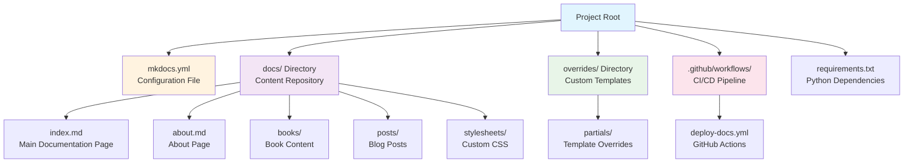
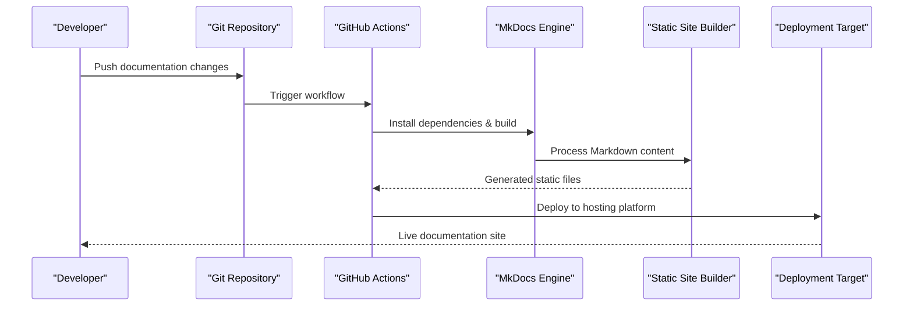
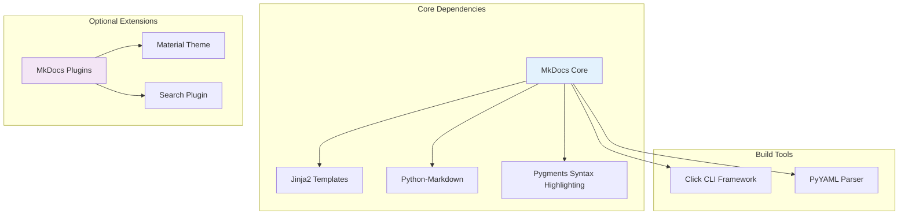

# Project Overview

<cite>
**Referenced Files in This Document**
- [mkdocs.yml](file://mkdocs.yml)
- [docs/index.md](file://docs/index.md)
- [.github/workflows/deploy-docs.yml](file://.github/workflows/deploy-docs.yml)
- [requirements.txt](file://requirements.txt)
- [main.py](file://main.py)
</cite>

## Update Summary
**Changes Made**
- Updated to reflect MkDocs static site generator migration
- Added GitHub Actions automated deployment workflow documentation
- Enhanced documentation structure with organized content directories
- Integrated git-based development workflow
- Added custom styling and theme customization capabilities

## Table of Contents
1. [Introduction](#introduction)
2. [Project Structure](#project-structure)
3. [Core Components](#core-components)
4. [Architecture Overview](#architecture-overview)
5. [Automated Deployment Workflow](#automated-deployment-workflow)
6. [Detailed Component Analysis](#detailed-component-analysis)
7. [Dependency Analysis](#dependency-analysis)
8. [Performance Considerations](#performance-considerations)
9. [Troubleshooting Guide](#troubleshooting-guide)
10. [Conclusion](#conclusion)

## Introduction

Ultra Blogs is a streamlined static documentation generator built on the powerful MkDocs framework, representing a complete migration from traditional web development to modern static site generation. This project demonstrates the elegance and simplicity of contemporary documentation workflows by leveraging a git-based development process with automated deployment through GitHub Actions.

The system transforms simple Markdown content into polished, searchable documentation sites with minimal configuration overhead, following the "less is more" philosophy that prioritizes content creation over infrastructure management. Unlike complex static site generators requiring extensive setup, Ultra Blogs embraces focused tooling that eliminates unnecessary complexity while maintaining professional-grade features.

The project serves as both a practical documentation solution and an educational example of how MkDocs can be effectively deployed for real-world technical documentation needs. By focusing on core MkDocs functionality combined with automated CI/CD pipelines, it provides developers with a reliable foundation for creating maintainable, scalable documentation systems.

## Project Structure

The Ultra Blogs project follows the canonical MkDocs directory structure with enhanced organization for content management:

This enhanced architecture represents a comprehensive documentation system that separates configuration, content, presentation, and deployment concerns while maintaining the simplicity that makes MkDocs ideal for small-to-medium documentation projects.

**Section sources**
- [mkdocs.yml](file://mkdocs.yml)
- [docs/index.md](file://docs/index.md)
- [.github/workflows/deploy-docs.yml](file://.github/workflows/deploy-docs.yml)

## Core Components

### Configuration Engine (mkdocs.yml)

The `mkdocs.yml` file serves as the central configuration hub for the entire documentation site, defining site metadata, theme selection, navigation structure, and plugin integration. This YAML-based configuration controls every aspect of site generation from basic properties like site name and description to advanced features like custom themes and build optimizations.

Key responsibilities include:
- Site metadata definition (name, description, version, repository URL)
- Theme and styling configuration with Material Design support
- Navigation menu structure and hierarchical organization
- Plugin activation and configuration for extended functionality
- Build output customization and deployment targets
- URL routing and pagination settings for content organization

### Content Processing Pipeline

The `docs/` directory houses all Markdown content that will be transformed into the final documentation website. The content processing workflow includes automatic table of contents generation, syntax highlighting, search indexing, and responsive design optimization.

The enhanced content structure supports:
- Organized content directories for different document types (books, posts)
- Custom styling through dedicated stylesheets directory
- Automatic link resolution and cross-referencing between pages
- Image optimization and asset bundling
- Search index creation for improved discoverability

**Section sources**
- [mkdocs.yml](file://mkdocs.yml)
- [docs/index.md](file://docs/index.md)

## Architecture Overview

The Ultra Blogs architecture follows a clean separation of concerns between configuration, content, presentation, and deployment layers:

This architecture ensures that documentation updates flow automatically from code commits to live deployment, eliminating manual deployment steps while maintaining consistency and reliability across all environments.

**Diagram sources**
- [.github/workflows/deploy-docs.yml](file://.github/workflows/deploy-docs.yml)
- [mkdocs.yml](file://mkdocs.yml)

## Automated Deployment Workflow

The project implements a robust CI/CD pipeline using GitHub Actions that automates the entire build and deployment process:

### GitHub Actions Configuration

The `.github/workflows/deploy-docs.yml` file defines the automated workflow that triggers on pushes to the main branch. The workflow handles dependency installation, MkDocs build execution, and deployment to the target hosting platform.

Key workflow components include:
- **Trigger Configuration**: Automatic execution on main branch pushes and pull requests
- **Environment Setup**: Python environment configuration with MkDocs dependencies
- **Build Process**: Complete documentation site generation with optimized assets
- **Deployment Strategy**: Automated publishing to static hosting platforms
- **Error Handling**: Comprehensive logging and failure notifications

### Development Workflow Integration

The git-based workflow enables seamless collaboration and version control for documentation projects:

This workflow ensures that documentation changes undergo proper review processes while maintaining rapid deployment cycles for approved updates.

**Section sources**
- [.github/workflows/deploy-docs.yml](file://.github/workflows/deploy-docs.yml)

## Detailed Component Analysis

### YAML Configuration System

The MkDocs YAML configuration system provides a declarative approach to site setup that focuses on describing desired outcomes rather than implementation details. The configuration hierarchy follows established principles for maintainable documentation projects.

The configuration structure supports:
- **Global Settings**: Site-wide properties including title, description, and repository information
- **Theme Configuration**: Visual appearance customization with Material Design theme support
- **Navigation Structure**: Hierarchical organization of documentation pages with custom menus
- **Plugin Ecosystem**: Extensibility through third-party plugins for enhanced functionality
- **Build Options**: Control over output format, caching, and deployment targets

### Enhanced Content Organization

The documentation structure has been enhanced to support various content types while maintaining simplicity:

- **Books Directory**: Dedicated section for comprehensive book-style documentation
- **Posts Directory**: Blog-style content for articles and tutorials
- **Stylesheets Directory**: Custom CSS for branding and visual customization
- **Overrides Directory**: Template modifications for advanced customization needs

### Comparison with Other Static Site Generators

Ultra Blogs leverages MkDocs specifically because it offers unique advantages over other static site generators in the documentation space:

| Feature | MkDocs (Ultra Blogs) | Jekyll | Hugo |
|---------|---------------------|--------|-------|
| **Learning Curve** | Minimal - Markdown only | Moderate - Ruby ecosystem | Low - Single binary |
| **Configuration** | YAML-based, declarative | Front matter + config files | TOML/YAML/JSON |
| **Content Format** | Pure Markdown | Markdown + Liquid templates | Markdown + shortcodes |
| **Build Speed** | Fast - incremental builds | Slow - full rebuilds | Very fast - single binary |
| **Theme System** | Built-in themes + customization | Gem-based themes | Go-based themes |
| **Plugin Ecosystem** | Python-based plugins | Ruby gems | Go plugins |
| **Deployment** | Simple static files | Requires Ruby environment | Single binary deployment |
| **CI/CD Integration** | Excellent - lightweight | Complex - environment setup | Good - binary deployment |

The key differentiator is MkDocs' focus on documentation-specific features out of the box, including automatic table of contents generation, search functionality, and responsive design patterns optimized for technical documentation.

**Section sources**
- [mkdocs.yml](file://mkdocs.yml)
- [docs/index.md](file://docs/index.md)

### Dependency Management

The project maintains minimal external dependencies through a well-defined `requirements.txt` file that specifies exact versions for reproducibility:

This dependency tree ensures reliability and performance while maintaining flexibility for future enhancements without introducing unnecessary complexity.

**Section sources**
- [requirements.txt](file://requirements.txt)

## Performance Considerations

Ultra Blogs is designed for optimal performance through several key strategies that ensure fast build times and efficient resource usage:

### Incremental Builds
MkDocs implements intelligent change detection that only rebuilds affected pages when content or configuration changes. This dramatically reduces build times during development, especially for large documentation sets with frequent updates.

### Asset Optimization
The build process automatically optimizes images, minifies CSS and JavaScript, and generates efficient caching headers. These optimizations ensure fast loading times across different devices and network conditions.

### Memory Efficiency
The processing pipeline uses streaming algorithms to handle large documents without excessive memory consumption. This makes Ultra Blogs suitable for documentation projects of any size while maintaining consistent performance characteristics.

### Caching Strategy
Intelligent caching mechanisms store processed assets and generated intermediates, enabling rapid rebuilds during development while ensuring fresh output for production deployments.

## Troubleshooting Guide

Common issues and their solutions when working with Ultra Blogs:

### Build Failures
- **YAML Syntax Errors**: Validate YAML syntax using online validators or MkDocs built-in validation
- **Missing Dependencies**: Ensure all required Python packages are installed via `pip install -r requirements.txt`
- **File Path Issues**: Verify relative paths in configuration and content links

### Content Rendering Problems
- **Markdown Syntax**: Use standard Markdown syntax; avoid non-standard extensions not supported by MkDocs
- **Image Paths**: Ensure images are in the correct location relative to content files
- **Link Validation**: Check internal and external links for broken references using MkDocs plugins

### Performance Issues
- **Large Images**: Optimize images before inclusion in documentation using compression tools
- **Excessive Plugins**: Review plugin necessity and performance impact on build times
- **Memory Constraints**: Monitor memory usage during builds for very large documentation projects

### Deployment Issues
- **GitHub Actions Failures**: Check workflow logs for specific error messages and dependency conflicts
- **Environment Variables**: Ensure required environment variables are configured in GitHub repository settings
- **Permission Issues**: Verify deployment credentials and repository access permissions

**Section sources**
- [mkdocs.yml](file://mkdocs.yml)
- [.github/workflows/deploy-docs.yml](file://.github/workflows/deploy-docs.yml)

## Conclusion

Ultra Blogs exemplifies the power of simplicity in static site generation through its strategic adoption of MkDocs and modern CI/CD practices. By leveraging the robust MkDocs foundation combined with automated deployment workflows, it provides a perfect balance between ease of use and professional capability for documentation projects.

The project demonstrates that effective documentation doesn't require complex toolchains or extensive configuration—just clear thinking about what matters most: getting quality content to readers efficiently through automated, reliable processes. The two-file architecture serves as both a practical solution and an educational model, showing how modern documentation tools can empower teams to focus on content creation rather than infrastructure management.

For beginners, Ultra Blogs offers a gentle introduction to static site generation concepts without overwhelming complexity. For experienced developers, it provides a reliable, maintainable foundation that scales with project needs while avoiding the pitfalls of over-engineering. Whether documenting a small library or a comprehensive API reference, Ultra Blogs provides the foundation needed to create professional, maintainable documentation that your users will love, with the added benefit of automated deployment and version control integration.