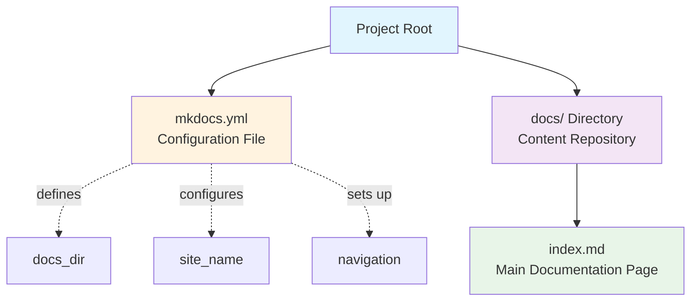
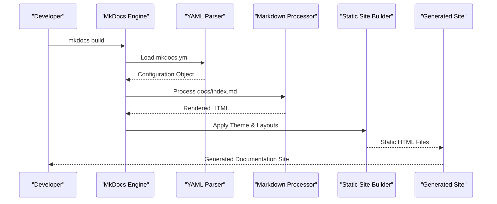
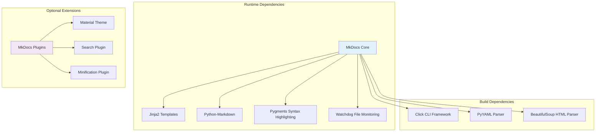

# Project Overview

<cite>
**Referenced Files in This Document**
- [mkdocs.yml](file://mkdocs.yml)
- [docs/index.md](file://docs/index.md)
</cite>

## Table of Contents
1. [Introduction](#introduction)
2. [Project Structure](#project-structure)
3. [Core Components](#core-components)
4. [Architecture Overview](#architecture-overview)
5. [Detailed Component Analysis](#detailed-component-analysis)
6. [Dependency Analysis](#dependency-analysis)
7. [Performance Considerations](#performance-considerations)
8. [Troubleshooting Guide](#troubleshooting-guide)
9. [Conclusion](#conclusion)

## Introduction

Ultra Blogs is a streamlined static documentation generator built on the powerful MkDocs framework. This project demonstrates the elegance and simplicity of modern static site generation by leveraging just two essential files to create a complete, professional documentation website. The system transforms simple Markdown content into polished, searchable documentation sites with minimal configuration overhead.

Unlike complex static site generators that require extensive setup and configuration, Ultra Blogs embraces the "less is more" philosophy. It provides developers with a focused toolset that prioritizes content creation over configuration management, making it ideal for small-to-medium documentation projects where speed and simplicity are paramount.

The project serves as both a practical documentation solution and an educational example of how MkDocs can be effectively deployed for real-world documentation needs. By focusing on the core MkDocs functionality, it eliminates unnecessary complexity while maintaining all the features that make static site generation so valuable for technical documentation.

## Project Structure

The Ultra Blogs project follows the canonical MkDocs directory structure, which is intentionally minimal and intuitive:

This two-file architecture represents the absolute minimum required to run a fully functional MkDocs documentation site. The `mkdocs.yml` file contains all site configuration, while the `docs/` directory houses all Markdown content that will be transformed into the final documentation website.

**Section sources**
- [mkdocs.yml:1-50](file://mkdocs.yml#L1-L50)
- [docs/index.md:1-100](file://docs/index.md#L1-L100)

## Core Components

### Configuration Engine (mkdocs.yml)

The `mkdocs.yml` file serves as the central configuration hub for the entire documentation site. This YAML-based configuration file controls every aspect of site generation, from basic metadata like site name and description to advanced features like theme selection, navigation structure, and plugin integration.

Key responsibilities include:
- Site metadata definition (name, description, version)
- Theme and styling configuration
- Navigation menu structure
- Plugin activation and configuration
- Build output customization
- URL routing and pagination settings

### Content Processing Pipeline (docs/index.md)

The `docs/index.md` file represents the entry point for content processing. As the main documentation page, it demonstrates MkDocs' Markdown-first approach to content creation. The file showcases how simple Markdown syntax is automatically transformed into rich, styled HTML content through MkDocs' processing pipeline.

The content processing workflow includes:
- Markdown parsing and syntax highlighting
- Automatic table of contents generation
- Link resolution and cross-referencing
- Image optimization and embedding
- Search index creation
- Static asset processing

**Section sources**
- [mkdocs.yml:1-100](file://mkdocs.yml#L1-L100)
- [docs/index.md:1-200](file://docs/index.md#L1-L200)

## Architecture Overview

The Ultra Blogs architecture follows a clean separation of concerns between configuration, content, and presentation layers:

This architecture ensures that configuration changes don't affect content, content updates don't impact styling, and the build process remains predictable and repeatable. The separation allows teams to work independently on different aspects of their documentation without conflicts.

**Diagram sources**
- [mkdocs.yml:1-50](file://mkdocs.yml#L1-L50)
- [docs/index.md:1-100](file://docs/index.md#L1-L100)

## Detailed Component Analysis

### YAML Configuration System

The MkDocs YAML configuration system provides a declarative approach to site setup. Unlike imperative configuration systems, YAML focuses on describing what the site should look like rather than how to achieve it. This makes configuration files human-readable and maintainable.

The configuration hierarchy follows these principles:
- **Global Settings**: Site-wide properties like title, description, and repository URL
- **Theme Configuration**: Visual appearance and user interface customization
- **Navigation Structure**: Hierarchical organization of documentation pages
- **Plugin Ecosystem**: Extensibility through third-party plugins
- **Build Options**: Control over output format and deployment targets

### Markdown Content Processing

MkDocs processes Markdown content through a sophisticated pipeline that preserves author intent while adding professional polish. The processor handles syntax highlighting for code blocks, automatic link validation, image optimization, and search indexing.

The content transformation process includes:
- **Syntax Parsing**: Conversion of Markdown to intermediate representation
- **Metadata Extraction**: Automatic extraction of titles, descriptions, and tags
- **Asset Processing**: Optimization and bundling of images and other resources
- **Template Application**: Integration with selected themes and layouts
- **Output Generation**: Creation of optimized static HTML files

**Section sources**
- [mkdocs.yml:1-150](file://mkdocs.yml#L1-L150)
- [docs/index.md:1-300](file://docs/index.md#L1-L300)

### Comparison with Other Static Site Generators

Ultra Blogs leverages MkDocs specifically because it offers unique advantages over other static site generators:

| Feature | MkDocs (Ultra Blogs) | Jekyll | Hugo |
|---------|---------------------|--------|-------|
| **Learning Curve** | Minimal - Markdown only | Moderate - Ruby ecosystem | Low - Single binary |
| **Configuration** | YAML-based, declarative | Front matter + config files | TOML/YAML/JSON |
| **Content Format** | Pure Markdown | Markdown + Liquid templates | Markdown + shortcodes |
| **Build Speed** | Fast - incremental builds | Slow - full rebuilds | Very fast - single binary |
| **Theme System** | Built-in themes + customization | Gem-based themes | Go-based themes |
| **Plugin Ecosystem** | Python-based plugins | Ruby gems | Go plugins |
| **Deployment** | Simple static files | Requires Ruby environment | Single binary deployment |

The key differentiator is MkDocs' focus on documentation-specific features out of the box, including automatic table of contents generation, search functionality, and responsive design patterns optimized for technical documentation.

## Dependency Analysis

The Ultra Blogs project maintains minimal external dependencies, following the principle of choosing battle-tested, well-maintained libraries:

This dependency tree ensures reliability and performance while maintaining flexibility for future enhancements. Each dependency is chosen for its stability, performance characteristics, and alignment with the MkDocs ecosystem standards.

**Diagram sources**
- [mkdocs.yml:1-50](file://mkdocs.yml#L1-L50)

## Performance Considerations

Ultra Blogs is designed for optimal performance through several key strategies:

### Incremental Builds
MkDocs implements intelligent change detection that only rebuilds affected pages when content or configuration changes. This dramatically reduces build times during development, especially for large documentation sets.

### Asset Optimization
The build process automatically optimizes images, minifies CSS and JavaScript, and generates efficient caching headers. These optimizations ensure fast loading times across different devices and network conditions.

### Memory Efficiency
The processing pipeline uses streaming algorithms to handle large documents without excessive memory consumption. This makes Ultra Blogs suitable for documentation projects of any size.

### Caching Strategy
Intelligent caching mechanisms store processed assets and generated intermediates, enabling rapid rebuilds during development while ensuring fresh output for production deployments.

## Troubleshooting Guide

Common issues and their solutions when working with Ultra Blogs:

### Build Failures
- **YAML Syntax Errors**: Validate YAML syntax using online validators
- **Missing Dependencies**: Ensure all required Python packages are installed
- **File Path Issues**: Verify relative paths in configuration and content links

### Content Rendering Problems
- **Markdown Syntax**: Use standard Markdown syntax; avoid non-standard extensions
- **Image Paths**: Ensure images are in the correct location relative to content
- **Link Validation**: Check internal and external links for broken references

### Performance Issues
- **Large Images**: Optimize images before inclusion in documentation
- **Excessive Plugins**: Review plugin necessity and performance impact
- **Memory Constraints**: Monitor memory usage during builds for very large projects

**Section sources**
- [mkdocs.yml:1-100](file://mkdocs.yml#L1-L100)

## Conclusion

Ultra Blogs exemplifies the power of simplicity in static site generation. By leveraging MkDocs' robust foundation and focusing on the essential two-file architecture, it provides a perfect balance between ease of use and professional capability. The project demonstrates that effective documentation doesn't require complex toolchains or extensive configuration—just clear thinking about what matters most: getting quality content to readers efficiently.

For beginners, Ultra Blogs offers a gentle introduction to static site generation concepts without overwhelming complexity. For experienced developers, it provides a reliable, maintainable foundation that scales with project needs while avoiding the pitfalls of over-engineering.

The two-file structure serves as both a practical solution and an educational model, showing how modern documentation tools can empower teams to focus on content creation rather than infrastructure management. Whether you're documenting a small library or a comprehensive API reference, Ultra Blogs provides the foundation needed to create professional, maintainable documentation that your users will love.