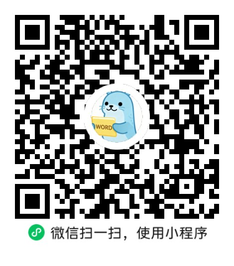

# 拍照识别单词：纸质词书秒变电子单词本

备考英语时，你有没有遇到过这些问题？

- 纸质词书上做了一堆标注，但碎片时间没法拿出来复习
- 市面上的背单词 APP 词库太全，80% 的词你都认识，背了浪费时间
- 手动把书上不会的词一个个录入手机，太慢太麻烦

**海狮单词生词本**微信小程序，帮你解决这些问题：拍一张纸质词汇表的照片，AI 自动识别单词、音标和释义，生成你的专属电子单词本。

## 核心功能

### 拍照识别单词

对准纸质词汇表拍一张照，小程序自动提取每个单词的：

- 英文单词或词组（支持 look forward to 这类词组）
- 英式音标和美式音标
- 中文释义

识别结果直接存入单词本，随时可以打开复习。

### 手写标记过滤（特色功能）

这是最实用的功能。

你在纸质词书上用笔勾出不认识或需要重点背的词——打勾、画圈、荧光笔标记都行。拍照时选择「标记模式」，AI 会识别哪些词有标记，**只提取这些词**。

这意味着：

- 老师划的重点词，拍一下就整理好了
- 自己标注的错词，不用手动录入
- 试卷上不会的生词，一扫即存

### 单词管理

- 新词和已掌握两种状态
- 标记为「已掌握」后自动从生词列表移除
- 支持删除不需要的词
- 按添加时间排序，最新录入的词在最前面

### 音标显示

自动识别英式和美式音标，如果纸质书上有音标会直接提取，没有的话也不会乱填。音标格式规范，不会出现 `[[]]` 这种重复括号。

## 适合谁用

**雅思/托福考生**

听力词书（如雅思王听力、538 考点词真经）上标注的生词，拍照直接录入。做完听力真题后，把不认识的词在书上标记，拍一张就整理好了。

**四六级考生**

课本词汇表批量导入，不用手动一个个输入。复习时只看自己不会的词，效率翻倍。

**初高中学生**

课本上的重点单词、老师划的必背词，拍照就能生成个人单词本。家长可以帮孩子整理错题本里的生词。

**英语自学者**

阅读英文原版书或文章时遇到的生词，随手记在书上，定期拍照整理到单词本里。

## 使用场景示例

### 场景一：雅思听力备考

1. 用《雅思王听力》做听力练习
2. 遇到不认识的词，在书上打个 ✓
3. 做完后打开小程序，选择「标记模式」拍照
4. 只提取打勾的词，生成你的听力错词本
5. 碎片时间打开复习

### 场景二：课本词汇整理

1. 翻开英语课本的词汇表页
2. 选择「普通模式」拍照
3. 整页词汇自动录入
4. 把已掌握的词标记为「已掌握」
5. 只剩不会的词需要重点背

### 场景三：试卷错题整理

1. 做完英语试卷，在试卷上标出生词
2. 拍照识别，录入单词本
3. 每次考前打开复习自己的专属错词

## 和其他背单词 APP 的区别

| | 海狮单词生词本 | 传统背单词 APP |
|---|---|---|
| 词库来源 | 你自己的书/试卷 | 预设词库（四六级/考研等） |
| 针对性 | 只背你不会的 | 背整个词库，很多已认识 |
| 录入方式 | 拍照自动识别 | 手动搜索添加 |
| 使用场景 | 配合纸质书使用 | 脱离纸质书 |
| 适合人群 | 有纸质词书的学习者 | 纯手机学习者 |

海狮单词生词本不是要替代传统背单词 APP，而是补充了一个缺失的环节：**把纸质书上的标注变成可复习的电子数据**。

## 使用限制

- 每天免费识别 5 次（AI 识别有调用成本）
- 图片大小不超过 2MB（小程序会自动压缩）
- 目前支持英文词汇识别

## 如何体验

微信搜索小程序「**海狮单词生词本**」，打开即可使用，无需注册登录。

拍照 → 识别 → 复习，三步搞定。

## 常见问题

**Q: 识别准确率怎么样？**

普通词汇表识别准确率 95% 以上。手写标记识别准确率约 90%，偶尔会有漏判，建议标记时用明显的勾号。

**Q: 支持手写词汇表吗？**

支持印刷体和手写体，但印刷体识别效果更好。如果是手写词汇表，尽量写工整一些。

**Q: 词组能识别吗？**

能。比如 look forward to、take into account 这类词组可以正确识别为一个整体。

**Q: 数据安全吗？**

单词数据存在云端服务器，登录同一微信账号即可同步。不会泄露你的学习数据。

**Q: 为什么限制每天 5 次？**

每次识别都需要调用 AI 视觉模型，有调用成本。每天 5 次对于正常备考使用已经足够，一般一天也就拍 1-2 张词汇表。
